# StartupNews.fyi — Architecture (`arch.md`)

> **Maintained by Jarvis.** This file is the single source of truth for *how the system is built*.
> It is updated on **every** change — minor, medium or major. `agent.md` records *what happened*
> (the narrative log); `arch.md` records *what the system now is* (the current shape);
> `Product.html` records *what the product does*, in plain language, versioned v1 / v2 / …
>
> - **Minor change** → update the affected section here + append a row to the Architecture Change Log below + log in `agent.md`. No new `Product.html` version.
> - **Medium / major change** → all of the above **plus** a new version block in `Product.html`.
>
> Last structural sync: **2026-09-13** (initial authoring, v1).

---

## 1. What this system is

**StartupNews.fyi** (repo name `zox-nextjs`) is a single Next.js application that plays four roles at once:

| # | Role | Who uses it | Entry point |
|---|---|---|---|
| 1 | **Public news & media site** — articles, categories, events, reports, brand stories | Anonymous readers, logged-in readers | `/`, `/[...slug]`, `/news`, `/events`, `/category/*` |
| 2 | **CMS / admin panel** — publish and manage all of the above | Staff (`admin`, `editor`, `author`, `event_admin`, `publisher_admin`, `it_support`) | `/admin/*` |
| 3 | **Internal business tools** — HR tool, Sales Tracker, Network Manager (CRM), Partnership Tracker, IT Tickets, Newsletter | Staff, scoped by role | `/admin/hr-tool`, `/admin/sales-tracker`, `/admin/it-tickets`, … |
| 4 | **Employee self-service portal** — punch in/out, leave, documents, KYC | Employees (separate credential table) | `/employee/*` |

Plus a **background process** (separate PM2 app) that runs cron jobs: RSS ingestion, scheduled
publishing of posts/reports/brand stories, and the morning signal email.

---

## 2. Runtime topology

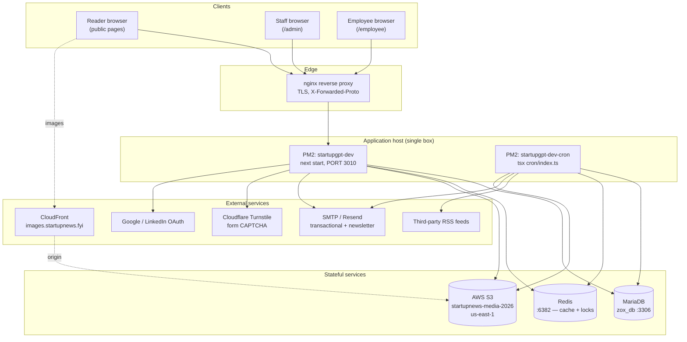

**Key facts**

- One Next.js process serves *all four* roles; there is no separate admin deployment.
- The cron process is a **separate PM2 app** sharing the same codebase, DB and Redis. It is *not*
  an HTTP service — it is a long-lived `node-cron` scheduler plus an in-memory queue + worker.
- Redis is **optional by design**: `redis.client.ts` fails soft — if the connection fails, caching
  is disabled for the process lifetime and everything still works (slower). Cron locking degrades
  with it, so a second cron instance is only safe while Redis is up.
- MariaDB is the only durable store for application data. S3 holds binary media only.
- **Every stateful service is loopback-only.** MariaDB, Redis, Adminer and Redis Commander are
  reachable from this box alone; nothing in `Data` is exposed to the internet. This is load-bearing,
  not hygiene — until 2026-09-18 these ports were published on `0.0.0.0` and `zox_db` was wiped
  through one of them (§8, and the 2026-09-17 row in §10). Reach them from elsewhere over an SSH
  tunnel, never by republishing a port.
- The **only** off-box backup of `zox_db` is `s3://startupnews-media-2026/db-backups/`, written
  twice daily (00:00 and 12:00 IST) by a job that runs on a *different* host — not this one. This
  box holds no dumps, `log_bin` is `OFF` and there is no backup cron here, so a restore always
  starts from S3.

---

## 3. Layered architecture

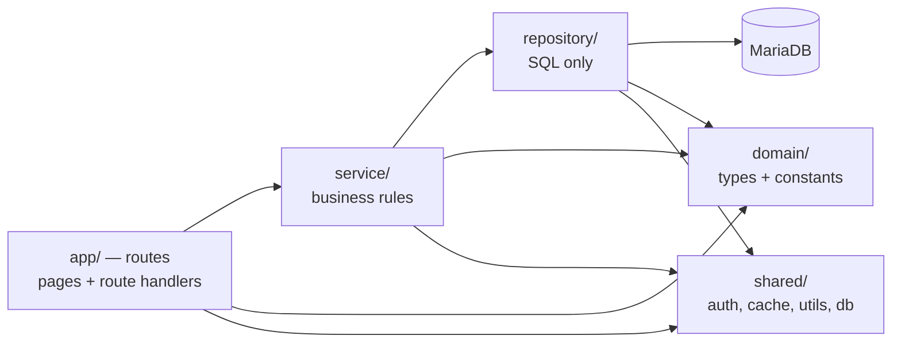

Every feature lives in `src/modules/<feature>/` with the same four folders:

| Folder | Responsibility | May import |
|---|---|---|
| `domain/` | TypeScript types, enums, constants, per-feature rules (e.g. `hr-tool/domain/kyc.ts`) | nothing else in the module |
| `repository/` | **All SQL.** One class, methods return domain types. Raw `query()` / `queryOne()` from `shared/database/connection` | `domain/`, `shared/` |
| `service/` | Business logic, validation, orchestration. Never writes SQL directly | `domain/`, `repository/`, `shared/` |
| `utils/` | Pure helpers for the feature (e.g. `hr-tool/utils/geofence.ts`, `lateness.ts`) | `domain/` |

**Invariant:** route handlers (`src/app/api/**/route.ts`) call **services**, not repositories, and
never contain SQL. Page components call services (server components) or fetch the API (client
components).

### Layer inventory

| Path | What lives there |
|---|---|
| `src/app/` | 78 pages + 172 API route handlers (App Router) |
| `src/components/` | 266 files — `admin/`, `ui/`, `user/`, and per-feature form component sets |
| `src/modules/` | 22 feature modules (table below) |
| `src/shared/` | `database/connection.ts`, `cache/redis.client.ts`, `locks/redis-lock.ts`, `middleware/` (auth, employee-auth, roles), `config/` (env validation, feature flags), `utils/` (logger, s3-presign, image-cdn, csv, dates, editor HTML, memory + execution guards) |
| `src/queue/` | `queue.interface.ts`, `queue.memory.ts`, `job-types.ts` — in-process job queue |
| `src/workers/` | `rss.worker.ts` — consumes queue jobs |
| `src/lib/` | Cross-page helpers: `sitemaps.ts`, `format/`, `validation/`, `rate-limit/`, `incubatx/` |
| `src/proxy.ts` | Next proxy/middleware: `/post/*` 410 handling + `X-Robots-Tag` on article paths (matcher skips any path starting with `sitemap`) |
| `cron/` | `index.ts` scheduler + 5 jobs |
| `scripts/` | Migrations (`scripts/migrations/*.sql`), seeds, imports, backfills, CSV exports |

---

## 4. Module registry

| Module | Purpose | Primary tables |
|---|---|---|
| `posts` | Articles: draft → scheduled → published, tags, SEO, robots | `posts`, `post_tags` |
| `categories` | Category tree + slugs | `categories` |
| `users` | Staff accounts + `AuthService` (JWT issue/verify) | `users` |
| `panel-admins` | Scoped panel accounts (`event_admin`, `publisher_admin`, `it_support`) | `panel_admins` |
| `public-users` | Reader accounts, Google/LinkedIn sign-in, newsletter prefs | `public_registrations`, `public_registration_founders`, `public_registration_funding_rounds` |
| `events` | Event listings + regions | `events`, `event_regions` |
| `partnership-events` | Partnership/sponsorship pipeline, site listing status | `partnership_events` |
| `event-submission` | Public event submissions | `events` (pending state) |
| `banners` | Home page banners | `banners` |
| `brand-stories` | Sponsored long-form + sections | `brand_stories`, `brand_story_sections` |
| `reports` | Paid/gated reports + sections, page counts | `reports`, `report_sections` |
| `inner-pages` | Editable content for standalone pages, partner logos | `inner_page_content`, `partner_logos` |
| `rss-feeds` | Feed registry, fetch state, imported items | `rss_feeds`, `rss_feed_items` |
| `contacts` | Network Manager CRM | `contacts` |
| `sales-tracker` | Sales leads + team | `sales_leads`, `sales_team_members` |
| `hr-tool` | Attendance, leave, payroll, onboarding, rules, geo-fencing, KYC. Every employee-owned record is keyed by `employee_id` (= `hr_employees.id`); `emp` is a display-name snapshot only (§9 #17) | `hr_employees`, `hr_attendance`, `hr_punch_log`, `hr_leave_requests`, `hr_regularizations`, `hr_payroll_runs`, `hr_payroll_entries`, `hr_rules`, `hr_teams`, `hr_onboarding`, `hr_expenses`, `hr_templates`, `hr_audit_log`, `hr_company_profile`, `hr_attendance_overrides`, `hr_document_upload_requests` |
| `hr-credentials` | Employee portal login (separate from staff auth) | `hr_employee_credentials` |
| `it-tickets` | Internal helpdesk: tickets, comments, attachments, key sequence. Raised by admin-panel staff and by plain employees from the employee portal (actor role `'employee'`); status rules in `domain/status-policy.ts` | `it_tickets`, `it_ticket_comments`, `it_ticket_attachments`, `it_ticket_key_seq` |
| `feature-startup-submissions` | "Feature your startup" pipeline | `feature_startup_submissions` |
| `funding-round-submissions` | Funding round submissions | `funding_round_submissions` |
| `press-release-submissions` | Press release submissions (`/submit-press-release`), mirrored into `sales_leads` | `press_release_submissions` |
| `sponsor-event-submissions` | Partner / Sponsor an Event submissions (`/sponsor-event`): own Sales Tracker card + mirrored into `sales_leads` | `sponsor_event_submissions` |
| `ens-travel-enquiries` | Expand North Star travel enquiries (the "Plan your visit" form at the foot of `/expand-north-star`): domain (`participation.ts` options + package inclusions; `sources.ts` Referred-by partners + How-did-you-find-us channels; `lead-status.ts` Confirmed / Followed Up / Cancelled + conversation note), repository, service (`normalizeEnquiryInput` shared by the public form and admin edits; `normalizeLeadStatusInput` admin-only). Own Sales Tracker card with editing, lead status and a "Followed Up Leads" tile. **Never written to `sales_leads`** — kept apart from the other pages' leads | `ens_travel_enquiries` |
| `incubatx-dossier` | IncubatX dossiers | `incubatx_dossiers` |
| `newsletter` *(routes + tables, no module folder)* | Newsletter categories, items, schedules | `newsletter_categories`, `newsletter_items`, `newsletter_schedules` |
| *settings* | Key-value site settings (e.g. footer copyright, hero images) | `site_settings`, `settings`, `admin_tools` |

---

## 5. Route surface

### Public (reader-facing)
`/` (home — the only route that renders `components/DelegationStrip.tsx`, the delegation announcement band; `showDelegationStrip = pathname === '/'` in `ConditionalLayout`, placed between `<Header />` and the banner carousel) · `/[...slug]` (article + legacy WP slugs) · `/news` · `/category/*` · `/author/*` · `/search` ·
`/events` · `/startup-events` · `/press-release` · `/about-us` · `/advertise-with-us` ·
`/our-partners` · `/ecosystem-partners` · `/incubatx` · `/careers` · `/dashboard` (reader) ·
`/expand-north-star` (Expand North Star 2026 event page — a **bare route**: `BARE_ROUTES` in `components/ConditionalLayout.tsx` renders it without the site `Header`, banner carousel or `Footer` (footer dropped 2026-09-19) and tags `#mvp-main-body-wrap` with `is-bare-route` so the page can drop the 72px header clearance; grounds run full width with a 1200px content column; `src/app/expand-north-star/page.tsx` loads Cairo via `next/font/google` as `--ens-font` → client `components/expand-north-star/ExpandNorthStarPage.tsx`; above the bar a sticky white band (`EnsDelegationTitle`) reads **"Startup Delegation to Dubai"**, its Montserrat 900 type sized to the band's width (`calc(100cqi / 18)`; ratio re-measured whenever the wording changes); the sticky event bar (`EnsNav`, full-width row: lockup → Launchpad → Konnect packed left, button `margin-left: auto` at the right gutter) ends in a **Participate Now** button that scrolls to `#ens-participate`, the closing enquiry section (`PlanYourJourney`), and a second, larger **Participate Now** under the 2025 figures (`ShowNumbers`) lands in the same place via the shared `scrollToParticipate()` in `hooks.ts` (reads the pinned band + bar heights at click time); `EnsPartners` reuses `PartnerLogosMarquee` with `rows={2}`, fed since 2026-09-19 by this page's own fixed `REFERRAL_PARTNER_LOGOS_FOR_MARQUEE` (referralPartnerLogos.ts, local files under `public/images/expand-north-star/logo_slider/`) rather than the admin Inner Pages feed `/our-partners` reads; the six `DelegationDays` cards date as `6th Dec 2026` (three-letter month) with the Day 1 host (Dubai Konnect) on its own `.ens-day-host` line under the title; media/links in `media.ts`, clips served from `public/images/gif/`. Everything above the closing section is static — the one API call on the page is the travel-enquiry form's `POST /api/expand-north-star/travel-enquiry`, see §6.6) ·
policy pages (`/privacy-policy`, `/terms-and-conditions`, `/editorial-policy`, `/return-refund-policy`, `/delete-your-account`) ·
lead-gen forms (`/feature-your-startup`, `/submit-funding-round`, `/submit-press-release`, `/submit-event`, `/list-your-event`, `/sponsor-event`, `/contact-us`) ·
SEO (`/sitemap_index.xml`, `/sitemap.xml`, `/sitemap-news.xml`, `/sitemap-posts-N.xml`, `/sitemap-events.xml`, `/sitemap-static.xml`, `/llms.txt`, `/unsubscribe`)

### Admin (`/admin/*`, 39 pages)
Dashboard · Posts (list/create/edit) · Categories · Authors · Banners · Events · Brand Stories ·
Reports · Inner Pages · RSS Feeds · Newsletter (+ categories) · Users · Registered Users ·
Panel Admins · Contacts · Sales Tracker · Partnership Tracker · HR Tool · Attendance · Leave ·
Documents · Rules & Policy · IT Tickets · HTML Tools · Login

### Employee (`/employee/*`)
Punch in/out + attendance, leave requests, documents upload + window, KYC, **IT Support**
(`/employee/it-tickets` — raise and track own IT tickets; the shared IT Tickets UI mounted with
`EMPLOYEE_TICKETS_CONFIG` from `src/lib/employee-it-tickets.ts`).

### API (184 handlers)
| Prefix | Count | Notes |
|---|---|---|
| `/api/admin/*` | 122 | JWT-gated, role-checked. `sales-tracker/ens-enquiries` (GET list; `[id]` GET + PATCH edit) serves the Expand North Star card. Biggest groups: `hr-tool` (30), `newsletter` (10), `it-tickets` (8, incl. `export`), `rss-feeds` (7), `contacts` (5) |
| `/api/employee/*` | 19 | Employee-credential auth (separate middleware). Includes `it-tickets` (8): list/create, get/update (no delete), comments, attachments, `me`, `presign` |
| `/api/public-auth/*` | 8 | Reader register/login, Google verify, LinkedIn OAuth, profile, newsletter prefs |
| `/api/events/*` | 8 | Public event reads + submission |
| `/api/cron/*` | 4 | HTTP-triggered job entry points |
| `/api/posts/*`, `/api/categories/*`, `/api/search`, `/api/banners`, `/api/reports`, `/api/brand-stories`, `/api/dashboard`, `/api/site-settings/*`, `/api/incubatx/*`, `/api/advertise`, `/api/feature-your-startup`, `/api/submit-funding-round`, `/api/submit-press-release`, `/api/events/sponsor-event`, `/api/expand-north-star/travel-enquiry`, `/api/newsletter`, `/api/unsubscribe`, `/api/health` | rest | Public reads and form intake |

---

## 6. Data flow diagrams

### 6.1 Level 0 — Context

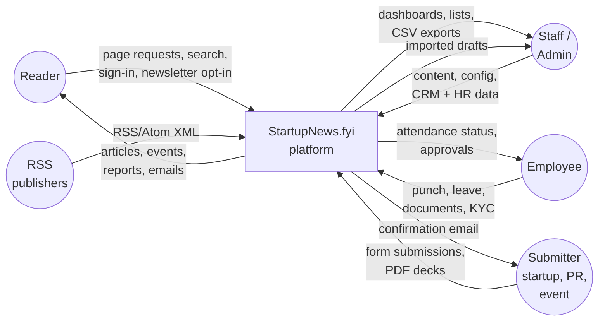

### 6.2 Level 1 — Main processes and stores

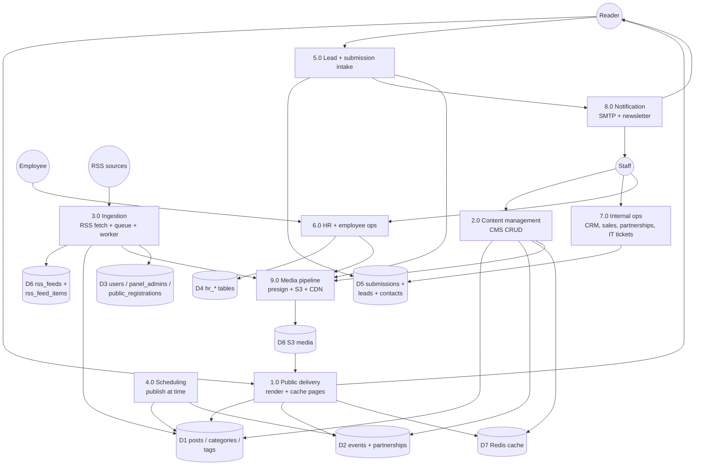

### 6.3 Level 2 — Article request (read path)

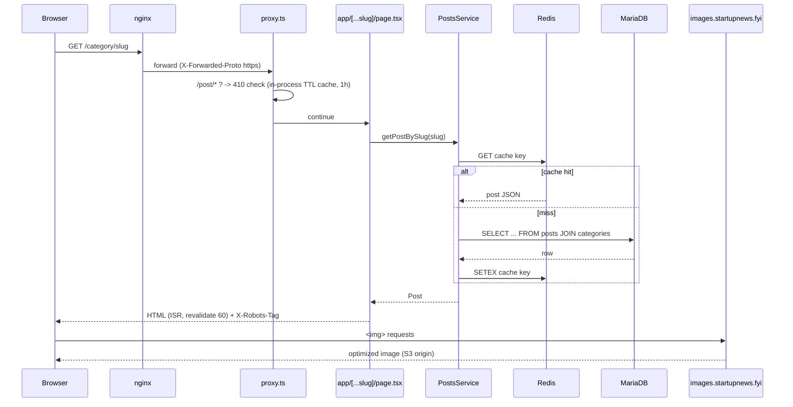

### 6.4 Level 2 — Admin authentication & role gating

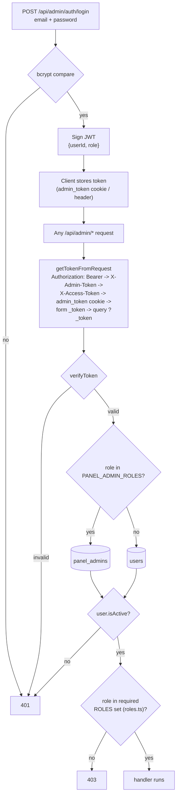

Role sets are centralised in `src/shared/middleware/roles.ts` (`EVENTS_ROLES`, `CONTENT_ROLES`,
`CONTENT_MANAGE_ROLES`, `REPORTS_ROLES`, `HR_TOOL_ROLES`, `IT_TICKETS_ROLES`,
`IT_TICKETS_MANAGE_ROLES`, …). **Never inline a role array in a route handler** — add or reuse a
set in `roles.ts` so the matrix stays auditable.

### 6.5 Level 2 — RSS ingestion (cron path)

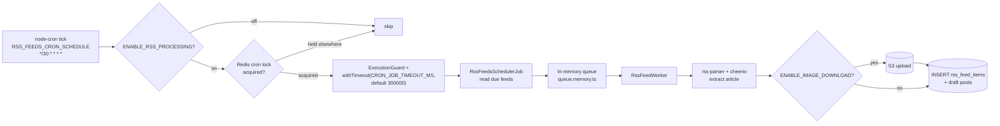

Other cron jobs on the same scheduler: `PostSchedulerJob`, `ReportSchedulerJob`,
`BrandStorySchedulerJob` (flip scheduled → published at due time) and `MorningSignalJob` (email).

### 6.6 Level 2 — Public submission / lead capture

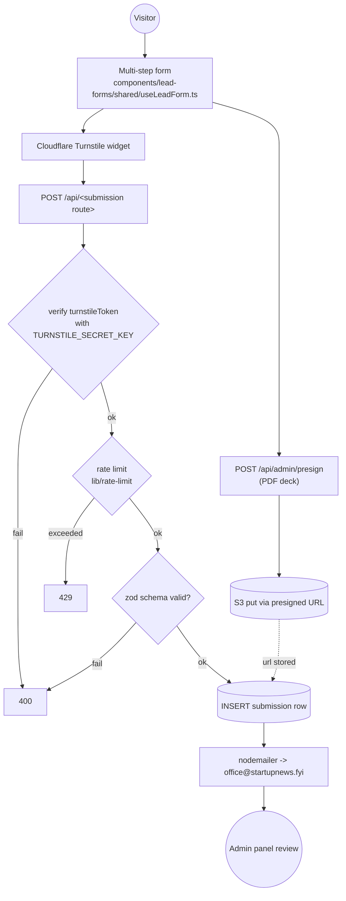

`useLeadForm` takes an optional `stepGroups: number[][]` that maps canonical validation steps onto
visual pages (default `[[1],[2],[3]]`). `/feature-your-startup` passes `[[1,2],[3]]` to render a
2-step wizard over 3 validation steps — that parameter is the shared seam; do not fork the hook.
`STEP_VALIDATOR_MAP` canonical steps: `1` name/company/phone · `2` email+website · `3` PDF ·
`4` email only · `5` website only (4/5 are additive splits of 2, added so `/submit-press-release`
can pass `[[1,4],[5],[]]` and ask for email on its first page). Never change 1–3 in place — other
pages depend on them; add a new canonical step instead.

**Page-lead mirroring into the Sales Tracker.** The three `useLeadForm` pages each pass a real
`onSubmit` (4th arg) and POST the same six fields (name, companyName, composed phone, email,
website, resolved country + city) to their own public route. There is no Turnstile, zod, PDF or
email on these three — the route rate-limits by IP (5 per 10 min, key-prefixed, in-memory
`checkRateLimit`), validates in the module service (`normalizeSubmissionInput`), inserts the raw
row, then **best-effort** mirrors it into `sales_leads` via `SalesTrackerService.saveLead`
(same id, `status = 'Query received'`); a mirror failure is logged, not returned.

| Page | Route | Raw table (id prefix) | `sales_leads.type` / `source` |
|---|---|---|---|
| `/feature-your-startup` | `POST /api/feature-your-startup` | `feature_startup_submissions` (`fys_`) | `Feature Page Leads` / `Feature Your Startup` |
| `/submit-funding-round` | `POST /api/submit-funding-round` | `funding_round_submissions` (`fr_`) | `Funding Round Page Leads` / `Submit Your Funding Round` |
| `/submit-press-release` | `POST /api/submit-press-release` | `press_release_submissions` (`pr_`) | `Press Release Page Leads` / `Submit Your Press Release` |
| `/sponsor-event` | `POST /api/events/sponsor-event` | `sponsor_event_submissions` (`se_`) | `Sponsor Event Page Leads` / `Sponsor an Event` |
| `/expand-north-star` | `POST /api/expand-north-star/travel-enquiry` | `ens_travel_enquiries` (`ens_`) | **none — not mirrored**; worked only from the Sales Tracker's own "Expand North Star enquiries" card |

**`/sponsor-event` is the exception** — its own hook (`components/sponsor-event/useSponsorEventForm.ts`,
not `useLeadForm`) and its own event-shaped fields (title, slug, location + country/city, external
URL, `event_date` `YYYY-MM-DD` / `event_time` `HH:MM` stored as VARCHAR, description, S3 `poster_url`,
contact name/email, optional phone). Route order: IP rate limit (5/10 min) → Turnstile → service
validate + insert (**must** succeed) → best-effort `sales_leads` mirror (`company` empty, event
summary in `query`) → best-effort SMTP email to `SMTP_TO` (values HTML-escaped; skipped with a warn
if SMTP isn't configured — it used to 500). The full record is read by the admin
`GET /api/admin/sales-tracker/sponsor-events` (`SALES_TRACKER_ROLES`) into
`components/admin/sales-tracker/SponsorEventSubmissionsCard.tsx` (KPI tiles All / Last 30 days /
Upcoming / Past → searchable table → read-only `SponsorEventDetailModal.tsx` with poster). The card
loads independently of `useSalesTrackerData`. **`se_` ids must stay ≤ 40 chars** — `sales_leads.id`
is `VARCHAR(40)`.

**`/sponsor-event` front end (redesign 2026-09-15, v8).** `src/app/sponsor-event/page.tsx` (server,
fetches `getPromotedCityOptions`) → `components/sponsor-event/SponsorEventPage.tsx` (client, owns
`useSponsorEventForm`, wraps everything in `MotionConfig reducedMotion="user"`, imports its own
`sponsor-event.css` — **no `.sp-*` rules remain in `globals.css`**). Sections in order:
`SponsorHero` → `EventReel` → `EventStory` → `WhyPartner` (`#sp-why`) → `EcosystemNetwork` →
`EventShowcase` (desktop: section height = 100vh + track overflow, sticky viewport, `x` from
`useScroll`; <960px / reduced motion: native scroll-snap row) →
`SubmissionJourney` → `EventAmplification` → `RoomBreak` → `SponsorFormSection` (`#sp-form`) →
`SponsorFormCard` (`StepProgress` + step card + `EventPreviewCard`, success via `SubmissionSuccess`).
Animation is `motion/react` only (GSAP is installed but unused here). Hydration-safe
`useReducedMotion` / `useWideScreen` / `useFinePointer` in `hooks.ts`. Media single sources:
`backgrounds.ts` (4 Mixkit clips + posters: hero, reel, community, room) and `eventImages.ts`
(Unsplash stills). The hero has no eyebrow and no buttons, the reel has no play/pause control or
marquee, and there is no "How you can partner" section (all removed 2026-09-15); `RoomBreak`'s
"Start your submission" is the page's only jump to `#sp-form`. No visible copy on the page uses an
em dash (Review step shows "Not provided" for empty values). Clips are
served from **`public/images/sponsor-event/video/`**, not `/videos/`, because `src/proxy.ts`'s
matcher excludes `images` but not `videos` — a `/videos/*.mp4` request runs the post-robots API
lookup on every byte-range fetch. `SponsorVideo.tsx` attaches `src` only within 240px of the
viewport, plays only while visible, and removes the `<video>` on error so the poster background
stays. The step components, validation, controller and API route were not changed by the redesign
(only `ReviewStep` Turnstile `theme: "light"`). Display step labels: Event details / Poster &
contact / Review — no numbered headings anywhere on the page.

**`/expand-north-star` enquiries have their own table and their own editable Sales Tracker card.**
The closing "Plan your visit" form collects name, email, composed contact, city, country,
**participation** (plus a free-text **requirement** under "Others"), and — since 2026-09-19 — two
source fields: **referredBy** (optional; one of eleven partner organisations) and **foundUs**
(required; a platform, or "Others" plus a free-text **foundUsDetail**). `modules/ens-travel-enquiries/`:
`domain/types.ts` (`EnsTravelEnquiry` incl. `referredBy: ReferredByValue | ''`, `foundUs`,
`foundUsDetail`, `createdAt`, `updatedAt` (null until an admin edit), `updatedBy`, `leadStatus` (null
= no conversation yet), `conversationNote`; `EnsTravelEnquiryAdminInput` = the visitor's fields + the
two conversation fields, which only the admin PATCH accepts), `domain/participation.ts` (the five
options, which package each maps to, each package's inclusions — plain data read by the API, the form,
the page's fee cards and the admin card alike), `domain/sources.ts` (`REFERRED_BY_OPTIONS` ×11,
`FOUND_US_OPTIONS` ×10 ending in `others`, `FOUND_US_OTHERS`, `FOUND_US_DETAIL_MAX_LENGTH` 200,
`NO_REFERRER_LABEL`, `referredByLabel` / `foundUsLabel` / `foundUsText` — the same one-list-for-both-
sides pattern as participation.ts), `domain/lead-status.ts` (`LEAD_STATUS_OPTIONS` confirmed /
followed-up / cancelled, `LEAD_STATUS_FOLLOWED_UP`, `CONVERSATION_NOTE_MAX_LENGTH` 2000,
`leadStatusLabel`), `repository/…` over `ens_travel_enquiries` (migrations
`add-ens-travel-enquiries-table.sql`, `add-ens-lead-status.sql` — `lead_status VARCHAR(20) NULL`,
`conversation_note TEXT NULL`, `idx_lead_status` — and `add-ens-referral-source.sql` — `referred_by
VARCHAR(40) NULL`, `found_us VARCHAR(40) NULL`, `found_us_detail VARCHAR(200) NULL`, `idx_referred_by`
— **all applied on dev** (first two 2026-09-17, third 2026-09-19); `updated_at` is set explicitly by
`update()`, never `ON UPDATE`), `service/…` (`normalizeEnquiryInput` — one rule set for the visitor and
for admin edits: an empty referrer is fine, a value must be listed; `foundUs` required and listed;
`foundUsDetail` required under `others`, ≤ 200 chars, and **dropped** for any other channel, exactly
as `requirement` is dropped for a package — `normalizeLeadStatusInput` — empty → NULL and the note
cleared, unknown value rejected, the note kept **only** under `followed-up` and dropped for any other
status — plus `create` → id `ens_` + UUID = 40 chars, and `update` returning the saved enquiry;
`entityToEnquiry` reads a pre-migration row's NULL `found_us` as `others` with no detail). The
notification email carries "Referred by" and "How they found us" after the requirement.
**Invariant (2026-09-17): these enquiries are NEVER written to `sales_leads`.** The team wants them
wholly apart from the other pages' leads, so there is no `to-sales-lead.ts` in this module, no
`PAGE_LEAD_TYPES` entry, and no admin-edit sync; the Sales Tracker card is their only home and the
Lead status on the enquiry is the only status they have. Rows mirrored before this rule were
removed by `scripts/migrations/remove-ens-mirrored-sales-leads.sql` (**run on dev 2026-09-17**;
run on live before deploying).

Public route order: IP rate limit (5/10 min, key `ens-travel-enquiry:`) → `service.create`
(400 visitor-facing message; insert **must** succeed, else 500) → best-effort escaped SMTP to
`SMTP_TO` (the email points to Sales Tracker → Expand North Star enquiries).

Admin: `GET /api/admin/sales-tracker/ens-enquiries` and `GET|PATCH …/ens-enquiries/[id]`
(`SALES_TRACKER_ROLES`). PATCH validates with the public rules plus `normalizeLeadStatusInput`,
stamps `updated_at` and `updated_by` (the admin's name) and returns the saved enquiry — nothing else
to keep in step. **Invariant:** `/api/admin/sales-tracker/ens-enquiries` is in the
admin layout's `isSpecialPath` list; without it the blanket post-write remount closes the detail dialog
~150ms after Save. UI: `components/admin/sales-tracker/EnsEnquiriesCard.tsx` (KPI tiles All / Last 30
days / Delegation / Booth-POD / Others / **Followed Up Leads** — the last one lists `followed-up`
**plus** `leadStatus === null`, i.e. the team's working list → searchable table with Participating-as,
Lead-status and Referred-by filters, "Referred by" / "How they found us" columns and a Lead status pill
column; row click or Enter opens the detail; loads
independently of `useSalesTrackerData`; edits update the row in place) and
`EnsEnquiryDetailModal.tsx` (Received on / Last updated + by, then a 2×2 grid of titled panels
`.ee-panel` — each with a `.ee-panel-head` title + one-line subtitle on a tinted strip and a
status-coloured top rule: **Contact** (tel/WhatsApp/mail links), **Travelling from**,
**Participating as** (that package's inclusions or the requirement), **Source** (Referred by / How
they found us, plus "In their words" under Others) and **Conversation** (status
pill and, under Followed Up, the conversation result; a dashed explanatory note for none / confirmed
/ cancelled); one column ≤ 720px; Edit mode with the
same fields plus a Lead status `<select>` and a "Conversation result" textarea shown only under
Followed Up, dirty-check on close, server errors inline), styles `.ee-*` (incl. `.ee-status.is-*`,
`.ee-form-divider`) in `SalesTrackerStyles.tsx`, rendered after the Sponsor Event card on
`/admin/sales-tracker`.

Front end: `components/expand-north-star/PlanYourJourney.tsx` (section, decor, scroll parallax) →
`JourneyForm.tsx` (grid, submit) → `JourneyField.tsx` (reveal wrapper only), with
`useJourneyForm.ts` holding state and `journeyValidation.ts` the rules.

**Every control is the site's own, not a look-alike** — `ui/FormField`, `ui/PhoneField` and
`submit-event/CountryCityFields`, the same three `/feature-your-startup` uses (see
`steps/DetailsContactStep.tsx`). So this page gets the shared dial-code list and the per-country
digit rules from `ui/constants/phone.ts`, the searchable `COUNTRIES` dropdown, and the City list
built from the admin Partnership Tracker's curated `COUNTRY_CITY_DATA` via `cityOptionsForCountry`.
`promotedCities` is fetched in the route with `getPromotedCityOptions()`, exactly as the other
submission pages fetch it. Country is asked before City because the City list is built from
whatever Country holds.

**Shared lead-form controls — the contract every public lead page relies on (2026-09-19):**

- **Row layout.** Email and phone share one row; country and city share the next, on all five pages
  (`/feature-your-startup`, `/submit-funding-round`, `/submit-press-release`, `/sponsor-event`,
  `/expand-north-star` — whose grid is Full Name | Participating As, inclusions, Email | Contact,
  Country | City, Referred By | How Did You Find Us, and a "Where Did You Find Us?" box under
  Others). Each page pairs them with its own two-column class (`.fys-field-row`,
  `.fr-field-row`, `.pr-field-row`, `.sp-field-row`, `.ens-jf-grid`) and `CountryCityFields` brings
  its own `.field-row`. Inside a half-row the dial-code select is trimmed to 100–104px so the number
  keeps its width (`.<page>-field-row .phone-row .custom-select-wrap`).
- **Country list.** `submit-event/constants.ts` `ALL_COUNTRIES` is exactly the 193 UN member states,
  spelled as the Partnership Tracker's canonical names (`USA` kept short by standing request; UK/UAE
  long, resolved through the tracker's aliases). `COUNTRIES` is a plain `localeCompare` sort — nothing
  is pinned to the top. `CountryCityFields` offers **no "Other (add manually)" country anywhere**
  (the `allowOtherCountry` prop was removed 2026-09-19): the public lead pages, `/list-your-event`
  (`EventBasicsStep`) and the admin Sales Tracker `LeadFormModal` are all list-only, so a country can
  only ever be stored under a listed spelling. `OTHER_COUNTRY_VALUE` survives only so resolvers
  (`compose.ts` `resolveCountry`, `submit-event/validation.ts`, the sponsor-event service) still read
  an old draft that holds it; `validateCountry` now simply requires a listed pick. The admin
  Partnership Tracker's Region/Country `SearchableSelect` likewise lost its pinned "Others…" row and
  the free-text `regionOther` mode (`buildRegionOptions` still appends a record's existing off-list
  value so old rows reopen intact). `LeadFormModal.splitLocation` maps a stored country through
  `canonicalCountryName` onto the list; an unmatched legacy value stays on the draft (placeholder
  shown, value preserved on save). The City "Other" row is unchanged everywhere (curated city lists
  are deliberately short).
- **Search.** `ui/CustomSelect` filters by **prefix only** — the start of the label or of any entry
  in the option's `keywords` — accent-insensitive (`normalize("NFD")`), keeping list order; there is
  no substring tier any more, so "c" lists only countries beginning with C. `alwaysShow` rows stay
  pinned at the bottom. There is **no search prompt**: a searchable select opened shows its own
  placeholder ("Select country") or its current value, and the reader types straight into it — the
  `searchPlaceholder` prop was removed 2026-09-19.
- **Dial codes.** `ui/constants/phone.ts` holds one `DIAL_CODES` table (code, ISO, `names[]`,
  min/max digits, optional pattern) covering every one of the 193 countries — 191 rows, since USA and
  Canada share `+1` and Russia and Kazakhstan share `+7` (a select cannot hold one value twice), and
  NANP islands carry their area code in the value (`+1876`). `PHONE_RULES` and `COUNTRY_CODE_OPTIONS`
  (now with `name` and `keywords`) are **derived** from it; add a country there, never to the two
  outputs. India keeps its `^[6-9]\d{9}$` pattern. `PhoneField`'s code select is a searchable
  combobox (trigger "IN +91", list rows add the country as `CustomSelect`'s `detail`); the "Other →
  +xxx" row is hidden unless `allowOtherCode` is passed (admin `LeadFormModal` only). `validatePhone`
  in `lead-forms/shared/validation.ts` and `sponsor-event/validation.ts` still fall back to
  `PHONE_RULES.other` for an unknown code, so legacy stored values keep validating.
- **CSS invariant.** Because the dial-code trigger now contains an `<input type="text">` of its own
  (`.cs-input`), every rule that sizes the "+xxx" box must be written `.phone-row > input[type=text]`
  (direct child) — done in globals.css (`.snf-page`, `.fys-page`, `.pr-page`, `.fr-page`),
  `sponsor-event.css`, `expand-north-star.css` (including its `:has(> input[type="text"])` stacking
  rule), `SalesTrackerStyles.tsx` and `IncubatxDossierForm.tsx`. A descendant selector there would
  restyle the combobox's input and break the row.

`lead-forms/shared/compose.ts` and `validation.ts`'s `validatePhone` are typed on the structural
subsets `PhoneParts` / `LocationParts` rather than on the whole of `LeadFormData`, so this form —
which has no company, website or pitch deck — composes `phone`/`countryCity` and validates the
number through that exact code. A full `LeadFormData` still satisfies both, so the three wizard
pages are unaffected. `useJourneyForm` keeps `useLeadForm`'s habits (a `DERIVED_FROM` map, one
writer for each canonical value, a `pendingRevalidation` effect) without being built on the engine
itself, which is a multi-step wizard over a field set this single-screen form does not share.

**Styling.** Those components render globals.css's `.field` / `.field-row` / `.field-error` /
`.phone-row` / `.custom-select-*` markup, which is styled there **only** under `.snf-page` — inside
`.ens-page` it arrives unstyled. `expand-north-star.css` dresses that same class set for this
section; nothing in globals.css is touched. The palette is set once as `--jf-*` custom properties
on `.ens-journey`.

The section is deliberately the **lightest** thing on the page and does not continue the near-black
delegation cards immediately above it (it opens out of them through a short top gradient): a form
is the one place here a reader has to do work, and work reads better on paper than on a console.
Warm off-white ground, a white card at 1040px with a hairline border and a soft shadow, charcoal
type, magenta kept for accents — asterisks, focus ring, button, and one magenta-to-violet hairline
on the card's top edge.

Four deliberate departures from the `.snf-page` rules, each commented in place:
`.field-error` is always laid out and only its opacity moves (the shared rule toggles `display`,
which would shove every row below it down the card mid-typing); `.phone-row` carries the border and
focus ring itself with the code select and number stripped bare inside it, so the pair reads as one
control; `.phone-row` stacks only when the "Other" code's free-text box is on screen (`:has()`),
since this card is wider than the wizard column; and the traveller count is one shell holding
minus / number / plus. Chrome's autofill background is overridden with an inset `box-shadow` plus
`-webkit-text-fill-color`.

**When a field is allowed to speak.** `useJourneyForm` keeps `touched` and `submitAttempted`
separate from `errors`, and `showError(field)` is what the form renders — a message may be computed
long before it should be shown. Text fields mark themselves touched on blur; **the two dropdowns
never do** (`blurValidate(field, false)`), because `CountryCityFields` resets City whenever Country
changes and the shared CustomSelect treats a click anywhere on the page as leaving it, so City
would otherwise scold a reader who had merely glanced at it. Country and City wait for Register;
once a message is up, picking a value clears it immediately.

Each module's `to-sales-lead.ts` type string **must** match an entry in
`components/admin/sales-tracker/constants.ts` `PAGE_LEAD_TYPES`, which feeds the "Filter: page
leads" dropdown in `LeadsTable` — a mismatch saves the lead but hides it from that filter.

**`/list-your-event` → Partnership Tracker (not the Sales Tracker).** `components/submit-event/`
(5-step wizard, `useSubmitEventForm`) → `POST /api/events/submit-event` →
`EventSubmissionService` (validate, map) → `PartnershipEventsService.createEvent` → a
`partnership_events` row (`partnership_status = 'Draft'`, `listing = 'Pending'`,
`source = 'Public Submission'`), reviewed in `/admin/partnership-tracker`. Step 4 (Images) also
collects four **optional social links** — `social_instagram`, `social_linkedin`, `social_x`,
`social_facebook` (`VARCHAR(500) NULL`). One definition, `SOCIAL_LINK_FIELDS` +
`normalizeSocialLink` + `socialLinkError` in `modules/partnership-events/domain/types.ts`, is used
by the form validators, the service and the admin modal: blank is allowed; a sent link gets
`https://` if schemeless and must be http(s) on that platform's host (Instagram `instagram.com`,
LinkedIn `linkedin.com`, X `x.com`/`twitter.com`, Facebook `facebook.com`/`fb.com`/`fb.me`,
subdomains allowed). These columns are **create-only**: `PartnershipEventsRepository.create()`
writes `WRITABLE_COLUMNS + CREATE_ONLY_COLUMNS`, `update()` writes `WRITABLE_COLUMNS` only; the
admin `POST` route and `importEvents` delete the keys from their input. The tracker shows them in a
read-only "Social media links" section of the Edit modal (read from the loaded record, never put
on `EventDraft`) and in the Excel export.

### 6.7 Level 2 — HR attendance with geo-fencing

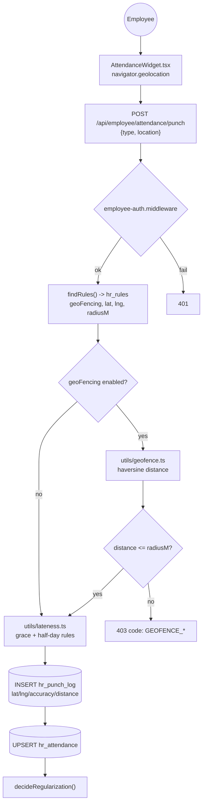

> Geo-fence columns were added by `scripts/migrations/add-hr-geofence.sql` and applied to live
> `zox_db` on 2026-09-13 (`agent.md` #777–#778). The toggle `hr_rules.geo_fencing` is **OFF** —
> nothing changes for employees until a Founder enables it. MariaDB returns `DECIMAL` lat/lng as
> **strings**, hence the `Number()` wrapping in `findRules()` / `geoFromRow()`.

> **Identity on this path is the employee id, never the name.** The punch/me/regularization/leave
> routes (employee portal and the Publisher/Event Admin `/api/admin/attendance/*` twins) call
> `HrToolService.resolveEmployeeForCredential(credentialId, name)`: match `hr_employees.credential_id`;
> fall back to the name only for a row with no `credential_id` whose name nobody else has. No match →
> "me" routes return `linked:false`, writes return 400 `NO_DIRECTORY_RECORD_ERROR`. `hr_punch_log` and
> `hr_attendance` are then written with `employee_id` + the `emp` name snapshot. The admin HR-tool
> write routes (`punch`, `regularizations`, `attendance`, `attendance-overrides`, `punch-log`) require
> `employeeId` in the body and fill `emp` from `findEmployeeRef`.
>
> **Payroll** (`computePayrollForMonth`): roster = `{credentialId, name, doj}` per login → Directory row
> by `credential_id` (unique-name fallback for unlinked rows) → attendance, leave, short-leave carry-over,
> TDS (`Record<employeeId, number>`) and `hr_payroll_entries` all by `employee_id`. The pay formula is
> unchanged. `backfillMissingEmployeeIds()` (throttled 60 s) links any row an older build wrote by name.

### 6.8 Level 2 — IT ticket lifecycle

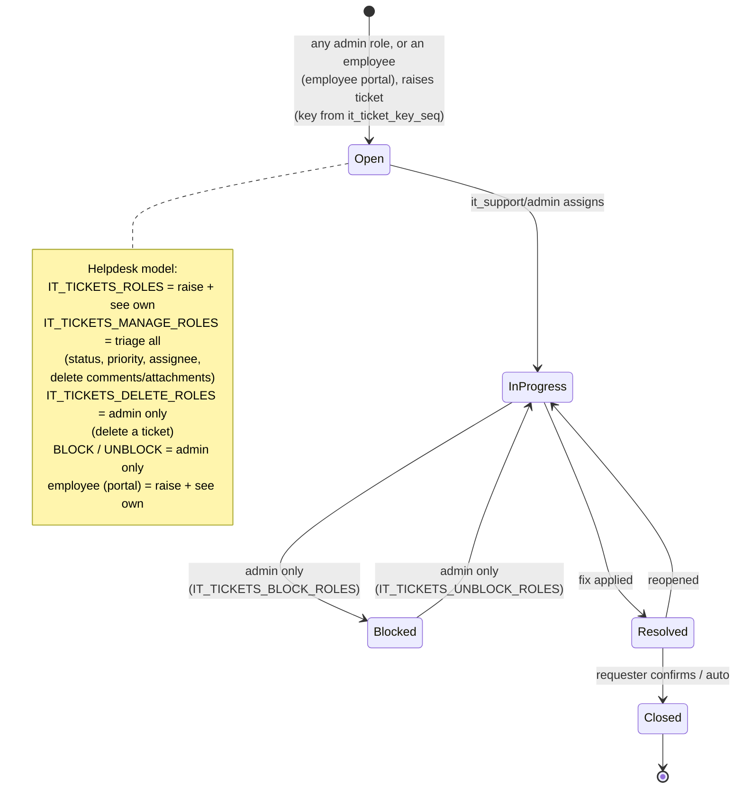

**Identity is the (id, role) pair, never the numeric id.** Reporters, assignees, comment authors and
uploaders may live in `users` *or* `panel_admins`, whose id sequences overlap (users#1 = admin,
panel_admins#1 = event_admin). `ItTicketsService` compares `(reporter_id, reporter_role)` etc. via
`isSameActor()`, the repository filters on both columns, and the assignee's display name is resolved
server-side from `(assigneeId, assigneeRole)` — the client never sends `assigneeName`.

**Mechanics (2026-09-14 rework).** `GET /api/admin/it-tickets/[id]` accepts the uuid *or* the human
key (`IT-12`) so `/admin/it-tickets?ticket=IT-12` deep-links. List rows carry `commentCount` /
`attachmentCount` (correlated subqueries in `TICKET_SELECT`). `mine=1` scopes managers to their own
tickets. Attachment `fileUrl` must start with the S3/CDN base the presign route hands out. Errors map
`TicketNotFoundError`→404, `TicketForbiddenError`→403, `TicketValidationError`→400, anything else→500
(`src/app/api/admin/it-tickets/_shared/route-helpers.ts`). The admin layout's write-triggered page
remount (`isSpecialPath` in `src/app/(admin)/layout.tsx`) **excludes** `/api/admin/it-tickets` — the
board/issue dialog own their state in `useItTicketsData`. UI: Jira-style board (`@dnd-kit` with a 6 px
`PointerSensor` activation distance and a body-portaled `DragOverlay` at z-index 1300), issue view
(two columns: content + status/details sidebar), "Create ticket" dialog with attachments and "Create
another", list view with client-side sort, and a small toast system (`Toast.tsx`).

**Status policy (Blocked is admin-only).** `canSetTicketStatus(role, from, to)` in
`src/modules/it-tickets/domain/status-policy.ts` (imports only `roles.ts`, so it is client-safe) is the one
rule set: no change is always fine; only managers change status; moving **into** Blocked needs
`IT_TICKETS_BLOCK_ROLES`, moving **out** needs `IT_TICKETS_UNBLOCK_ROLES` (both `['admin']`). The service
checks it in `updateTicket` (403 with `statusDenialMessage`) **and** in `createTicket` (so "+ Create" in the
Blocked column is not a way round it); IT Support can still edit priority/assignee/due date on a blocked
ticket. The UI reads the same function: disabled "Blocked (Admin only)" options, a locked lozenge on a
blocked ticket, an "Admin only" label on the Blocked column, and refused board drops checked in
`onDragEnd` (columns stay droppable so the refusal can show a toast).

**Employee portal surface.** Plain employees (Employee ID with no linked panel admin) reach the same
service through `src/app/api/employee/it-tickets/**` behind `requireEmployeeAuth`, as actor
`{ id: hr_employee_credentials.id, role: 'employee', name }` (`employeeActor` in `_lib.ts`). Being a
non-manager, they see and comment on only tickets they reported, edit summary/description only while To Do,
never set status/assignee, and have **no delete-ticket or assignees route** (DELETE → 405). `me/route.ts`
returns the actor identity (the employee session stores no credential id); `presign/route.ts` signs
uploads for images/PDF/text/CSV/Office/ZIP (octet-stream only for .log/.txt/.csv/.zip; never svg/html),
keyed by `s3KeyForItTicketAttachment`. Error mapping and the attachment URL allow-list are shared with the
admin routes via `src/app/api/_shared/it-tickets-http.ts`. Client side, the components are API-agnostic:
`TicketsClientContext.tsx` (`ADMIN_TICKETS_CONFIG` default; employee config in
`src/lib/employee-it-tickets.ts`), `createTicketsApi(config)` / `useTicketsApi()` in `api.ts`, and a
viewer that is synchronous for admin and loaded from `/me` for employees. In the admin view, people with
role `'employee'` carry an "Employee" tag.

**Reports + Excel export (admin panel, managers only).** `buildTicketReport(tickets)` in
`src/components/admin/it-tickets/reports.ts` is the single source of the numbers: 9 headline KPIs, six
breakdowns (status, priority, issue type, assignee by (id, role) — top 8 + Others + Unassigned — where it
was raised, due-date health) and an assignee × status workload matrix. It feeds both the on-page
`TicketReports.tsx` panel (plain-SVG donut charts, shown by default, hide state in sessionStorage) and the
export. `GET /api/admin/it-tickets/export` (`IT_TICKETS_MANAGE_ROLES`; filters parsed by the shared
`parseTicketFilters` in `_shared/route-helpers.ts`, identical to the list route) returns the filtered tickets
plus all their comments and attachments (`ItTicketsService.exportTickets` →
`findCommentsForTickets` / `findAttachmentsForTickets`, `IN (…)` chunked at 500). The workbook is built in
the browser by `excel-export.ts`, dynamic-imported on click together with its npm dependencies **`exceljs`
4.4.0** (styled sheets: Summary, Tickets, Workload, Comments, Attachments) and **`jszip`** 3.10.2, which
re-opens the file and injects **native OOXML pie charts** for the Summary sheet: `xl/charts/chartN.xml`
(one `c:pieChart` per breakdown, `c:cat`/`c:val` referencing that table's `'Summary'!$A`/`$B` cells with
caches, per-slice `c:dPt` colours, percentage labels), one `xl/drawings/drawingN.xml` with a
`twoCellAnchor` per chart, the drawing/sheet relationships, a `<drawing r:id>` placed before
`legacyDrawing/tableParts/extLst` in the sheet XML, and `[Content_Types].xml` overrides. Dates are written
as real Excel dates shifted to the viewer's local time; ticket keys and attachment names are hyperlinks.
Authors and employees get neither the panel nor the export (API 403/401).

### 6.9 Level 2 — Media upload pipeline

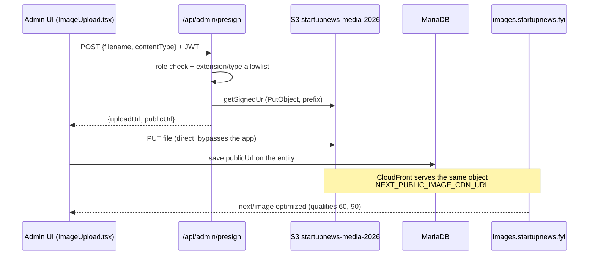

---

## 7. Cross-cutting concerns

### 7.1 Authentication — three independent systems

| System | Store | Credential | Guard | Surfaces |
|---|---|---|---|---|
| **Staff/admin** | `users` + `panel_admins` | email + bcrypt → JWT (`JWT_SECRET`) | `shared/middleware/auth.middleware.ts` + `roles.ts` | `/admin/*`, `/api/admin/*` |
| **Employee** | `hr_employee_credentials` | own login → own token | `shared/middleware/employee-auth.middleware.ts` | `/employee/*`, `/api/employee/*` — incl. IT tickets, where the credential becomes ticket actor `(id, 'employee')` |
| **Reader** | `public_registrations` | email/password, Google, LinkedIn OAuth | `/api/public-auth/*` | `/dashboard`, newsletter prefs |

The JWT `role` claim decides **which table the id is resolved against** — `event_admin`,
`publisher_admin`, `it_support` live in `panel_admins`; everything else in `users`. Token
extraction deliberately accepts six sources (header, `X-Admin-Token`, `X-Access-Token`, cookie,
form field, query param) because proxies/WAFs strip `Authorization` on some GET and multipart
requests.

### 7.2 Caching

| Layer | Mechanism | Notes |
|---|---|---|
| Page | Next ISR (`revalidate = 60` on hot pages) | Build writes into `NEXT_BUILD_DIR`, swapped atomically by `deploy.sh` so ISR writes can't clobber a half-swapped build |
| Data | Redis via `getCache`/`setCache` | Fails soft to no-cache |
| Proxy | In-process `Map` in `proxy.ts`, 1h TTL + in-flight de-dupe | Robots/410 status per post slug |
| Images | CloudFront + `next/image` (`qualities: [60, 90]`) | 90 = hero/LCP, 60 = carousel thumbs |

### 7.3 Background work

`cron/index.ts` → `node-cron` schedule → **Redis lock** (`createCronLock`) → `ExecutionGuard`
(skips if the previous run is still active) → `withTimeout` → job. Queue is **in-memory**
(`queue.memory.ts`), so jobs do not survive a restart — acceptable because every job is
re-derivable from DB state on the next tick.

Feature flags (`shared/config/feature-flags.ts`): `ENABLE_CRON`, `ENABLE_RSS_PROCESSING`,
`ENABLE_IMAGE_DOWNLOAD`. **Default in production is OFF when the var is unset** — they must be set
explicitly in `.env`.

### 7.4 SEO

`lib/sitemaps.ts` holds shared queries; route handlers emit split sitemaps — index
(`/sitemap_index.xml` and `/sitemap.xml` serve the same index), news (last 7 days, max 1000,
excludes press-release; Google News itself only reads the last 2 days), posts
(`/sitemap-posts-N.xml`, 50,000/file — the protocol limit — oldest-first by id, served via a
`next.config.ts` rewrite), events (upcoming partnerships), static (`/delete-your-account` is not
listed). No sitemap emits `<lastmod>` or `<changefreq>`. `proxy.ts` adds `X-Robots-Tag`
on article paths and **its matcher skips every path starting with `sitemap`**. `ROBOTS_NOINDEX=true`
on the dev host keeps the staging copy out of the index — except `/events`, whose page metadata
sets `index,follow` explicitly.

**Titles:** `lib/seo-title.ts` `seoTitle(...parts)` builds `<title>` ≤ 70 chars: parts joined by
" | " plus the brand, dropping trailing segments (brand first, then e.g. "Startup Events") until it
fits, then cutting the headline at a word boundary with "…". Returned as `{ absolute }` so the root
layout's `%s | StartupNews.fyi` template can't re-append. Used by article + category metadata
(`[...slug]`), `startup-events/[slug]` and `events/[slug]`; OG/Twitter titles are not capped.
Pages that hardcode "| StartupNews.fyi" in a plain string title (press-release, author, dashboard,
delete-your-account) still get it doubled by the template.

**Heading order:** on article pages the post title `<h1>` is the first heading — the banner
carousel title (`BannerCarousel.tsx`), the post category tag (`FullArticle.tsx`) and the homepage
"Latest News" labels are `
`s; `style.css` rules for `h3.mvp-feat1-pop-head` /
`h3.mvp-post-cat` also match the `div` variants.

### 7.5 Styling — three co-existing systems (deliberate)

1. **Plain CSS** (`globals.css`, `style.css`, `media-queries.css`) — the default for the whole site.
2. **Isolated Tailwind v4** — two scoped sheets, both `source(none)` + explicit `@source` lines,
   both unlayered (no `layer(theme)`) or they lose the cascade to the legacy reset:
   `src/app/isolated-tailwind.css` for the public marketing routes (`/about-us`,
   `/advertise-with-us`, `/careers`, `/contact-us`, `/ecosystem-partners`), and
   `src/components/admin/it-tickets/it-tickets-tailwind.css` for the **one** Tailwind admin
   feature, imported by `src/app/(admin)/admin/it-tickets/layout.tsx` and (same components, employee
   config) `src/app/employee/it-tickets/layout.tsx`. Every new file that uses
   classes must be added as an `@source` line; class names must be literal strings. Because
   Preflight is skipped, buttons/inputs there carry explicit `border-transparent` / `font-sans`
   resets (see `ui.ts`) so the legacy theme's element styles don't leak in. The IT Tickets sheet
   also defines a plain `.it-tickets-scope` rule set (on the page root and the portaled
   DragOverlay ghost): `box-sizing: border-box` for every descendant — without it `w-full` +
   padding overflowed every form control — and the admin Inter font stack, inherited by all
   descendants. Its `ui.ts` tokens deliberately mirror `.sales-tracker-page`
   (40px inputs, 38px buttons, `#6366F1` primary, 14px cards, 16px modals with a grey footer).
3. **Per-page scoped blocks** in `globals.css` (e.g. everything under `.fys-page`).
4. **Component-imported sheets** — a `.css` file imported by the component it styles, so the rules ship with it and stay out of `globals.css`: `components/partner-logos-marquee.css`, `components/delegation-strip.css`, `components/expand-north-star/expand-north-star.css`. Next still emits these globally, so every rule is namespaced by the component's own class prefix (`.pl-`, `.sn-ds`, `.ens-`).

`postcss.config.mjs` must keep `@tailwindcss/postcss` **before** `postcss-import`.

### 7.6 Operational guards

`ExecutionGuard` (overlap), `withTimeout` (hung jobs), `memory-guard.ts`, `redis-lock.ts`
(multi-instance), DB pool tuned in `connection.ts`: `connectionLimit` 18 (capped to 5 during
build), `minimumIdle` capped at 5 so idle connections are actually returned, `timezone: '+05:30'`,
`dateStrings: true`, and `process.env.TZ = 'Asia/Kolkata'` set at module load.

---

## 8. Environments & deployment

| | Dev host |
|---|---|
| Domain | `dev.startupgpt.fyi` |
| Web process | PM2 `startupgpt-dev` — `npm start` on **port 3010** |
| Cron process | PM2 `startupgpt-dev-cron` — `tsx --env-file=.env cron/index.ts` |
| DB | MariaDB `zox_db` @ `127.0.0.1:3306` |
| Redis | `redis://127.0.0.1:6382` |
| Logs | `./logs/nextjs.log`, `./logs/cron.log` |
| Deploy | `./deploy.sh` — lockfile cancels in-flight deploy → `npm ci` → `rm -rf .next` → `npm run build` → `pm2 restart` both apps |

> `deploy.sh` exists because of a real 2026-08-02 incident: `.next` was rebuilt while the old
> `next start` process kept serving stale chunk names → `ChunkLoadError`. **A rebuild must always
> be paired with a PM2 restart in the same run.**

`docker-compose.yml` provides local MariaDB 10.11 (`:3306`), Redis 7 (`:6382`), Adminer (`:8080`)
and Redis Commander (`:8081`). All four are bound to `127.0.0.1` — see the ransomware note below.
Only `zox-mariadb` belongs to this project; despite the `zox-` prefix, `zox-redis`,
`zox-adminer`, `zox-redis-commander` and `zox-postgres` are all run by the **MorningPulse**
compose project in `/root/MorningPulse`, so `docker compose up -d` here will not recreate them.

> ### Ransomware wipe of `zox_db` — 2026-09-17
>
> At **12:26:48 UTC** an attacker connected to MariaDB from the internet as `root`, dropped every
> table in `zox_db`, and left a Bitcoin ransom note in a table named `RECOVER_YOUR_DATA_info`. The
> note quoted this box's own credentials back at it (`200.234.41.185 + root`) and told the reader to
> keep the database reachable from outside. The site then served `ER_NO_SUCH_TABLE` (1146) on every
> page; `site_settings` and `event_regions` reappeared at 13:12 only because application code
> re-creates them if missing.
>
> **How they got in — two failures, both required:**
> 1. `docker-compose.yml` published `3306` on `0.0.0.0`, and Docker's own iptables rules bypass
>    `ufw` (which was inactive anyway), so the port was open to the internet.
> 2. The `root@%` account still had the compose file's literal default password, `rootpassword`.
>
> The container log shows brute-force attempts from 2026-09-11 onward — ~3,000 denials across 15+
> source IPs trying `root`/`admin`/`sa`. `zox_user`'s password had already been rotated to a strong
> value at some earlier point and was **not** the way in.
>
> **Recovery.** Nothing on this box could rebuild the data: `log_bin` `OFF`, `general_log` `OFF`, no
> dumps on disk, no backup cron. It was restored on 2026-09-18 from
> `s3://startupnews-media-2026/db-backups/zox_db_20260918_000001.sql.gz` (158 MB uncompressed,
> 63 tables, dumped 2026-09-18 00:00:13 IST). That dump comes from the other host — MariaDB
> **10.6.22** on Ubuntu, not this 10.11 container — so it was current only to ~2026-09-16 and the
> three 2026-09-17 ENS migrations had to be re-applied on top of it.
>
> **What changed as a result:** all four published ports bound to `127.0.0.1`; the compose file now
> reads `MYSQL_ROOT_PASSWORD` / `MYSQL_PASSWORD` from the gitignored `.env` instead of hardcoding
> them; the MariaDB `root` password was rotated (new value in `.env` as `MARIADB_ROOT_PASSWORD`);
> and `scripts/lockdown-ports.sh` drops external traffic to 3306/8080/6382/8081 on both IP families.
>
> **Closed out on 2026-09-18.** `zox-mariadb` was recreated (`docker compose up -d mariadb`) and now
> publishes `127.0.0.1:3306` only, with no IPv6 binding; the data came through unchanged (64 tables,
> 190 users, 13,096 posts, 36,568 contacts) and the `--max-allowed-packet=64M` pin is finally live
> from the container's own `command:` rather than a runtime `SET GLOBAL`, so it now survives a
> restart. The other four containers belong to the MorningPulse project and still publish on
> `0.0.0.0`, so for those `scripts/lockdown-ports.sh` remains the only protection. It now also
> covers `5432` (MorningPulse's Postgres was taking brute-force attempts too, and that app reaches
> it on `127.0.0.1`, so closing it externally costs nothing) and is re-applied at every boot by the
> **`lockdown-ports.service`** systemd unit, ordered `After=docker.service` because Docker rewrites
> its own chains on start.
>
> **Account exposure.** Passwords are bcrypt (`$2b$`) in `users.password_hash`, so they are not
> readable even if the attacker took a copy; weak ones are still crackable offline, so a reset is
> prudent rather than urgent. There are only **two** admin accounts — `admin@startupnews.fyi` (id 1)
> and `aditya@startupnews.fyi` (id 226) — plus 188 author accounts. `sessions` is empty, so no
> stolen session needs invalidating.

> **MariaDB packet limit.** The `mariadb` service runs with `command: ["mariadbd", "--max-allowed-packet=64M"]`.
> On 2026-09-14 a runtime `SET GLOBAL` (source unknown; no config sets it) had dropped
> `max_allowed_packet` to 2048 bytes, and every `hr_rules` save failed with errno 1153
> `ER_NET_PACKET_TOO_LARGE`. The `saveRules` upsert text alone is more than 2 KB. `SET GLOBAL` only affects
> **new** connections, so after changing it the PM2 apps must be restarted to recycle the
> `getDbConnection()` pool (`minimumIdle` keeps 5 connections open for good). The compose `command:`
> only takes effect when the container is recreated (`docker compose up -d mariadb`).
>
> **It happened again on 2026-09-15.** `zox-mariadb` still runs plain `["mariadbd"]` (started 2026-09-09,
> never recreated, so the compose pin is not active) and the global was back at 2048 bytes. Every
> `PUT /api/admin/hr-tool/employees` (whole Directory, ~15 KB) failed with `ER_SOCKET_UNEXPECTED_CLOSE`.
> The runtime `SET GLOBAL max_allowed_packet = 67108864, net_buffer_length = 16384` was re-applied. PM2 was
> **not** restarted, so the live app's already-open pooled connections keep 2 KB until they recycle.
> Recreating the container makes 64M survive a restart, but it does **not** stop this: the container had
> not restarted (uptime ≈ 6 days), so something ran a runtime `SET GLOBAL` lowering it to 2048 between
> the 2026-09-14 fix and 2026-09-15. That source is still unknown. `replaceAllRows` inserts **one row per
> statement**, so the limit bites per row: an `hr_employees` row with KYC/documents JSON (≈2–4.5 KB),
> the `hr_rules` upsert, `updateEmployeeKyc` and long templates exceed 2 KB; attendance, punch,
> regularization, leave, expense, ticket and payroll-entry rows don't. Reads were unaffected at 2 KB.

**Migrations** are raw SQL in `scripts/migrations/` applied manually against the live DB **only
after explicit user confirmation**. There is no `mysql` client binary on the app box — migrations
are applied through a throwaway `tsx` script that loads `.env` via `@next/env` and uses the app's
own `getDbConnection()` pool.

---

## 9. Invariants — do not break these

1. **No SQL outside `repository/`.** No repository calls from route handlers.
2. **No inline role arrays.** Roles come from `shared/middleware/roles.ts`.
3. **Never build, `pm2 restart`, or apply a migration unless the user explicitly asks.**
4. **Never delete sections from `agent.md`** — append or update only.
5. Tailwind classes work only where a scoped sheet lists the file in an `@source` line: the public
   marketing routes under `src/app/isolated-tailwind.css` and the IT Tickets feature (admin and employee routes) under
   `src/components/admin/it-tickets/it-tickets-tailwind.css`. Everywhere else, write plain CSS.
6. Redis must stay optional — no code path may assume a cache hit.
7. Cron jobs must be idempotent; the in-memory queue loses work on restart by design.
8. Lat/lng and other `DECIMAL` columns come back from MariaDB as **strings** — coerce with `Number()`.
9. `proxy.ts`'s matcher must keep skipping `sitemap*` paths.
10. Every schema change needs a file in `scripts/migrations/` — no ad-hoc DDL.
11. `partnership_events.social_*` link columns are organiser-owned and **create-only** — never add
    them to the repository's `WRITABLE_COLUMNS` or put them on the tracker's `EventDraft`.
12. **A staff identity is the (id, role) pair.** `users.id`, `panel_admins.id` and `hr_employee_credentials.id`
    (ticket actor role `'employee'`) are independent sequences that overlap, so any
    ownership or scoping check (IT tickets reporter/assignee/author/uploader, and anything similar
    added later) must compare both columns — never the numeric id alone.
13. The admin layout's write-triggered page remount (`isSpecialPath` in `src/app/(admin)/layout.tsx`)
    must keep excluding features that manage their own client state (`hr-tool`, `it-tickets`);
    add a new feature to that list rather than working around the remount inside the feature.
14. **Every IT ticket status change goes through `canSetTicketStatus`**
    (`src/modules/it-tickets/domain/status-policy.ts`) — on create and update in the service, and in every
    UI control that changes status. Never hard-code who may block/unblock in a component or route; change
    `IT_TICKETS_BLOCK_ROLES` / `IT_TICKETS_UNBLOCK_ROLES` in `roles.ts` instead.
15. **Any extra Next process against the shared `zox_db` (a temporary `next dev`, a test `next start`)
    must run with a small pool**, e.g. `DB_CONNECTION_LIMIT=3 DB_IDLE_TIMEOUT=10000 npx next dev …`.
    `.env` sets `DB_CONNECTION_LIMIT=50`, `minimumIdle` keeps up to 5 open per pool, and `next dev`
    creates several pool instances as routes compile — on 2026-09-14 one dev server held 123 of MariaDB's
    151 `max_connections`, and the live `startupgpt-dev` app, its cron and every DB call got
    `ER_CON_COUNT_ERROR` until that dev server was stopped.
16. **IT Tickets report numbers come only from `buildTicketReport`** (`components/admin/it-tickets/reports.ts`).
    The on-page Reports panel and every Excel sheet/chart read it, so a new breakdown or KPI is added there
    once. Chart parts in the export must keep referencing the Summary table cells they sit next to.
17. **HR records are keyed by employee id; names are display only.** The nine employee-owned tables
    (`hr_attendance`, `hr_attendance_overrides`, `hr_punch_log`, `hr_regularizations`, `hr_leave_requests`,
    `hr_expenses`, `hr_tickets`, `hr_payroll_entries`, `hr_document_upload_requests`) are read, matched,
    upserted and deleted by `employee_id`; managers by `manager_id` (`hr_employees`, `hr_teams`). `emp` /
    `manager` are name snapshots kept for display and re-synced from `hr_employees` after every Directory
    save (`cascadeEmployeeRename`, which must run **after** the employee rows are written). Two employees may
    share a name — never add a lookup, unique key or client comparison on the name. Client screens compare
    `employeeId` and render `employeeName(employees, id, snapshot)` (`components/admin/hr-tool/utils.tsx`).
18. **`scripts/migrations/hr-link-records-by-employee-id.sql` Part 2 runs right after the build that ships
    the id-keyed code** (build → pm2 restart → Part 2). Until then the old name-based unique keys
    (`uniq_emp_date`, `hr_attendance_overrides`/`hr_punch_log` PKs on `emp`, `uniq_month_emp`) still exist,
    so two employees with the same name would still collide on those tables.
19. **No stateful service is ever published beyond `127.0.0.1`,** and no credential is ever a literal
    in a tracked file. `zox_db` was destroyed on 2026-09-17 by exactly that pair — `3306` on
    `0.0.0.0` plus `root`/`rootpassword` in `docker-compose.yml` (§8). A published port is not
    protected by `ufw`: Docker writes its own iptables rules and bypasses it. Tunnel over SSH
    instead, and keep secrets in the gitignored `.env`.

---

## 10. Architecture Change Log

Every change to this system appends a row here. `Impact` drives what else gets updated:
**minor** = `arch.md` + `agent.md`; **medium/major** = those plus a new `Product.html` version.

| # | Date | Impact | Area | Change | Product.html version |
|---|---|---|---|---|---|
| 1 | 2026-09-13 | major | Documentation | Initial authoring of `arch.md` (topology, layering, module registry, route surface, 9 DFDs, cross-cutting concerns, invariants) and `Product.html` v1; documentation maintenance protocol added to `CLAUDE.md` | v1 |
| 2 | 2026-09-13 | minor | HR tool — Create Employee form | `nextEmployeeCode()` (`src/components/admin/hr-tool/views/CredentialFields.tsx`) dropped its `Math.max(...nums, 100)` floor and now preserves zero-padding (min 4 digits): next ID = highest trailing number across `hr_employee_credentials.employee_code` + 1 (`SNFYI-0027` → `SNFYI-0028`); also fixes `EditCredentialModal`. `HireEmployeeButton.tsx`: Department no longer pre-selects `state.teams[0]`, Reporting Manager starts at "— Select —", and `managerOf()` no longer silently falls back to the Department's manager (blank ⇒ `manager: null`; HR can act at any approval stage). Legacy `nextEmployeeId()` (`E-###`, `utils.tsx`) still has the 100 floor — internal record key only, not shown in the UI | — |
| 3 | 2026-09-14 | minor | Public lead form — `/submit-press-release` | Removed the "The Desk" section: `EditorialDesk` component deleted (`src/components/press-release-submit/EditorialDesk.tsx`) and dropped from `PressReleasePage.tsx`; all `.pr-desk-*` rules (main block + 1080px/900px responsive overrides) removed from `src/app/globals.css`. Page order now hero → ticker → standards → moment → process → form → closing. Form/submission flow untouched | — |
| 4 | 2026-09-14 | medium | Public lead form — `/submit-press-release` → Sales Tracker | Press release form now saves (was a fake 900 ms submit). New module `src/modules/press-release-submissions/` (domain/repository/service + `to-sales-lead.ts`), new table `press_release_submissions` (migration `scripts/migrations/add-press-release-submissions-table.sql`, additive, **not yet applied**), public `POST /api/submit-press-release` (IP rate limit 5/10 min, validation, insert, best-effort mirror into `sales_leads` with type `Press Release Page Leads`). `PressReleasePage.tsx` passes `submitPressRelease` as `useLeadForm`'s `onSubmit`; `ReviewStep.tsx` shows `submitError` (`.pr-submit-error` in globals.css); `PAGE_LEAD_TYPES` gained `'Press Release Page Leads'`. §4 registry, §5 API list and §6.6 page-lead mirroring table updated | v2 |
| 5 | 2026-09-14 | minor | Public lead form — `/submit-press-release` field order | Official Email moved from The Source (step 2) to The Story (step 1), after Phone. `lead-forms/shared/validation.ts` `STEP_VALIDATOR_MAP` gained additive canonical steps `4` (email) and `5` (website); steps 1–3 unchanged for Feature Your Startup / Funding Round. Press release `stepGroups` `[[1],[2],[]]` → `[[1,4],[5],[]]`; `StoryStep`/`SourceStep`/`ReviewStep` updated. No API or schema change | — |
| 6 | 2026-09-14 | minor | Database — dev `zox_db` | Applied `scripts/migrations/add-press-release-submissions-table.sql` on dev: `press_release_submissions` now exists (0 rows), fixing the 1146 "table doesn't exist" 500 from `POST /api/submit-press-release`. Live still needs it run by hand before deploy — `deploy.sh` does not run migrations (see §8) | — |
| 7 | 2026-09-14 | medium | `/sponsor-event` → Sales Tracker (own card) | Sponsor-event form now saves (was email-only). New module `src/modules/sponsor-event-submissions/` (domain/repository/service + `to-sales-lead.ts`), table `sponsor_event_submissions` (migration `scripts/migrations/add-sponsor-event-submissions-table.sql`, **applied on dev**). `POST /api/events/sponsor-event` rewritten: rate limit → Turnstile → save → best-effort lead mirror (`Sponsor Event Page Leads`) → best-effort escaped SMTP email. New admin `GET /api/admin/sales-tracker/sponsor-events`. Sales Tracker page gains `SponsorEventSubmissionsCard` (4 KPI tiles → table → `SponsorEventDetailModal`), helpers `sponsorEventsApi.ts` / `sponsorEventFormat.ts`, `.se-*` styles in `SalesTrackerStyles.tsx`; `PAGE_LEAD_TYPES` += `'Sponsor Event Page Leads'`. §4, §5, §6.6 updated | v3 |
| 8 | 2026-09-14 | medium | `/list-your-event` social links → Partnership Tracker (read-only) | Step 4 gains optional Instagram / LinkedIn / X (Twitter) / Facebook link inputs. 4 nullable `VARCHAR(500)` columns on `partnership_events` (migration `scripts/migrations/add-partnership-events-social-links.sql`, **not yet applied** — required before the build goes live, since `create()` now inserts these columns). Shared `SOCIAL_LINK_FIELDS` / `normalizeSocialLink` / `socialLinkError` (domain types) drive form validation, `EventSubmissionService` validation and the admin display. Repository `CREATE_ONLY_COLUMNS` (insert only); admin `POST` route and `importEvents` strip the keys. Tracker Edit modal: new read-only section 11 + 4 Excel export columns. §6.6 and §9 (#11) updated | v4 |
| 9 | 2026-09-14 | minor | Database — dev `zox_db` | Applied `add-partnership-events-social-links.sql` on dev (on explicit request): `partnership_events` now has `social_instagram`, `social_linkedin`, `social_x`, `social_facebook` (`VARCHAR(500)` NULL, after `social_creatives`), fixing the 1054 "Unknown column 'social_instagram'" on every INSERT. Live still needs it run by hand before deploy (see §8) | — |
| 10 | 2026-09-14 | minor | Admin — Partnership Tracker filters | Removed the "⚠ N location issues" toggle button from the filter bar (`partnership-tracker/page.tsx`), along with everything that only served it: `onlyLocationIssues` state + its filter step, dependency and `clearFilters` reset, the `locationIssueCount` memo, the `Derived.locationIssue` field (and its online-event special case in `computeDerived`), and the `locationIssue` import. The helper `locationIssue()` in `modules/partnership-events/domain/country-city-data.ts` is kept (exported, now without callers). No API or schema change | — |
| 11 | 2026-09-14 | minor | Database config + HR Rules save | Fixed every `PUT /api/admin/hr-tool/rules` failing with errno 1153 `ER_NET_PACKET_TOO_LARGE`: `zox-mariadb` had a runtime `max_allowed_packet` of 2048 bytes. Ran `SET GLOBAL max_allowed_packet = 67108864, net_buffer_length = 16384` as root inside the container, restarted PM2 `startupgpt-dev` + `startupgpt-dev-cron` to recycle pooled connections, and pinned `command: ["mariadbd", "--max-allowed-packet=64M"]` in `docker-compose.yml` (see §8). Also `HrToolContext.persistRules` now resolves `Promise<boolean>` and `views/Rules.tsx` (`commitRuleEdits`, `saveCtcSplit`) writes the audit-log entry only on success, so failed saves are no longer logged as changes. The UI change needs a build to go live | — |
| 12 | 2026-09-14 | medium | Admin — IT Tickets (`/admin/it-tickets`) | **Bug fixes + Jira-style redesign, tested end-to-end.** (1) `src/app/(admin)/layout.tsx` `isSpecialPath` now excludes `/api/admin/it-tickets` — every ticket write used to remount the page 150 ms later, closing the dialog and reloading the board. (2) Ownership/scoping by `(id, role)` everywhere (`isSameActor`, paired repository filters, `reporterRole`/`assigneeRole` in `ItTicketFilters`); assignee name resolved server-side; new `IT_TICKETS_DELETE_ROLES = ['admin']` in `roles.ts` replaces the inline array (UI hides Delete for IT Support). (3) `TicketValidationError` + shared `_shared/route-helpers.ts` (`toActor`, `ticketErrorResponse`) give 400/403/404/500 correctly; title ≤255, body ≤10000, `dueDate` `YYYY-MM-DD`, LIKE wildcards escaped, attachment `fileUrl` allow-listed to the S3/CDN base. (4) `TICKET_SELECT` adds `comment_count`/`attachment_count`; `findByKey` + `getTicket(idOrKey)` for `?ticket=IT-n` deep links; `mine=1`; `status` on create for managers. (5) UI rewritten: `KanbanBoard` (PointerSensor distance 6, KeyboardSensor on Space, `closestCorners`, body-portaled `DragOverlay` z-1300, "Other" column for unknown statuses, per-column "+ Create"), `TicketCard` (type/priority icons, overdue pill, count badges, avatar), `TicketFormModal` ("Create ticket": type/priority selects with icons, 255 counter, Assign to me, attachments uploaded after create with progress, Create another), `TicketDetailPanel` (breadcrumb, copy link, inline summary/description edit, attachments, activity with relative times, status lozenge + Details sidebar), `TicketListTable` (sortable), `FilterBar` (debounced search, assignee avatar chips, Only my tickets, Clear filters), new `TicketIcons`/`Avatar`/`StatusLozenge`/`FieldSelects`/`Modal`/`Toast`; `useItTicketsData` returns server rows, aborts stale list requests, `patchLocal`/`upsertLocal`; `page.tsx` wraps in `Suspense`. Verified with a 33-check Playwright run (admin / it_support / author personas) on a temporary `next dev -p 3011`; IT-1..IT-3 left as samples. §6.8, §7.5, §9 (#5, #12, #13) updated | v5 |
| 13 | 2026-09-14 | minor | Admin — IT Tickets styling | Brought `/admin/it-tickets` in line with the other admin tools and fixed text/control overflow. Root cause of the overflow: the scoped Tailwind sheet skips Preflight, so controls stayed `content-box` and `w-full` + padding ran past their column (Create dialog Summary/Description off the edge, Due date into Assignee). `it-tickets-tailwind.css` gains `.it-tickets-scope` (border-box + Inter stack, inherited); `ui.ts` tokens re-based on `.sales-tracker-page` (new `CARD`, `FIELD_TEXTAREA`, `FIELD_OPTIONAL`); page head now "IT Tickets" 26px/13.5px with no extra wrapper padding; `FilterBar` is a card with filters + view switch on row 1 and assignee chips + Only my tickets on row 2; board columns flex (`min-w-[232px] flex-1`) so all five fit at laptop widths; `TicketFormModal` rebuilt on a grid with `min-w-0` cells, "Assign to me" in the label row (`AssigneeSelect showAssignToMe={false}`), dashed file picker, grey footer; `Modal` 16px radius / 720px; long summaries, descriptions, comments and URLs wrap (`overflow-wrap:anywhere`); list table `min-w-[1040px]` with no-wrap names. No API/schema change. Not yet built — dev.startupgpt.fyi shows it after the next build | — |
| 14 | 2026-09-14 | minor | Admin — Sales Tracker + IT Tickets page width | Removed the 1400px page cap so both tools fill the content area and stretch when the sidebar collapses, the same way Posts and Newsletter already do (neither sets a max-width). `.sales-tracker-page` in `SalesTrackerStyles.tsx`: `max-width: 1400px` → `width: 100%` (the modal's own 1400px cap is unchanged); `ItTicketsPage.tsx` root: `max-w-[1400px]` → `w-full`. Measured at a 1920px viewport: Posts, Sales Tracker and IT Tickets all 1786px wide with 0px blank on the right (previously 386px on the two tools). Not yet built | — |
| 15 | 2026-09-14 | medium | IT Tickets — employee portal + admin-only Blocked | **Employees:** new `/employee/it-tickets` ("IT Support" in the employee sidebar; `<main>` width uncapped on that route) and 8 route files under `src/app/api/employee/it-tickets/` (`requireEmployeeAuth` → actor `(credential id, 'employee')`; list/create, get/update, comments, attachments, `me`, `presign`; no delete-ticket, no assignees). Employees see only tickets they raised. Shared helpers moved to `src/app/api/_shared/it-tickets-http.ts`; new `s3KeyForItTicketAttachment`. UI made API-agnostic: `TicketsClientContext.tsx`, `createTicketsApi`/`useTicketsApi`, async viewer via `/me`; employee view defaults to List without a Reporter column; admin view tags `'employee'` reporters/authors. **Blocked:** `IT_TICKETS_BLOCK_ROLES` / `IT_TICKETS_UNBLOCK_ROLES = ['admin']` + `domain/status-policy.ts`, enforced in `createTicket` and `updateTicket` (403) and mirrored in `StatusLozenge`, `TicketListTable`, `TicketDetailPanel` and `KanbanBoard` (refused drops toast; "Admin only" column label). Also fixed a board bug where a refused drag left the card ignoring its next click. No schema change. §4, §5, §6.8, §7.1, §7.5, §9 (#5, #12, #14, #15) updated. Invariant #15 comes from testing this change: a temporary `next dev` with the `.env` pool size exhausted MariaDB's 151 connections and broke every DB call on the box until it was stopped. Verified: API 40/40, browser 27/27, admin regression 8/8. Not yet built | v6 |
| 16 | 2026-09-14 | medium | IT Tickets — Reports panel + Excel export with native pie charts | New `reports.ts` (`buildTicketReport`, `describeFilters`), `TicketReports.tsx` (KPI tiles + six SVG donut charts, "Reports / Hide reports" toggle), `excel-export.ts` (exceljs workbook: Summary / Tickets / Workload / Comments / Attachments; jszip injects six native DrawingML pie charts bound to the Summary tables), header buttons "Reports" + "Export Excel" for admin/it_support in the admin panel only. New `GET /api/admin/it-tickets/export` (managers; tickets + comments + attachments for the current filters), `ItTicketsService.exportTickets`, repository `findCommentsForTickets` / `findAttachmentsForTickets`, shared `parseTicketFilters` (list route refactored onto it). **New npm dependencies: `exceljs@4.4.0`, `jszip@3.10.2`** (dynamic-imported on click; `package.json` + lockfile changed). §5 counts, §6.8 and §9 #16 updated. Not yet built | v7 |
| 17 | 2026-09-15 | medium | Public lead form — `/sponsor-event` redesign | Page rebuilt as a cinematic partnership story ending in the unchanged 3-step form: 11 section components under `src/components/sponsor-event/` (hero intro, reel, story, why-partner panels, scroll-built network, pinned horizontal showcase, partnership options, journey timeline, amplification, room break, form), new `StepProgress`, `SponsorVideo`, `CtaButton`; 9 old section components deleted. Styles moved out of `globals.css` (old `.sp-*` block removed) into `components/sponsor-event/sponsor-event.css` imported by `SponsorEventPage.tsx`. `motion/react` only, `MotionConfig reducedMotion="user"`. 5 Mixkit clips + posters added under `public/images/sponsor-event/` (`/images/` so `src/proxy.ts`'s matcher skips them). No API, validation, controller or schema change (`ReviewStep` Turnstile theme → light). §6.6 front-end paragraph added. Not yet built | v8 |
| 18 | 2026-09-15 | minor | Public lead form — `/sponsor-event` content removals | On request: hero eyebrow ("Partner with StartupNews.fyi") and both hero CTAs removed (`SponsorHero` now takes no props; `CtaButton` solid-only, ghost/outline CSS removed); "24" reach card → "24+"; `EventReel` play/pause button and formats marquee removed (+ `.sp-reel-toggle`, `.sp-marquee*`, `sp-marquee`/`sp-ping` keyframes); whole "How you can partner" section removed (`PartnershipOptions.tsx` deleted, `.sp-option*` CSS, `sponsorVideos.partner`, `eventImages.ticketing`, `TicketIcon`/`PlayIcon`/`PauseIcon`, and `public/images/sponsor-event/{video/partner-handshake.mp4,partner-handshake-poster.jpg}` deleted); every visible em dash replaced across section copy, form error messages (`useSponsorEventForm`, `PosterContactStep`), the Review step's empty values ("Not provided") and the shared `CountryCityFields` "no listed cities" hint (also shown on `/list-your-event`). `.sp-hero` now vertically centred at `min(calc(100svh - 100px), 780px)` so the shorter copy block stays above the fold. No API/validation/schema change. §6.6 paragraph updated. Not yet built | — |
| 19 | 2026-09-15 | major | HR tool — records keyed by employee id; Directory edit form | **Schema:** `scripts/migrations/hr-link-records-by-employee-id.sql`. **Part 1** (applied to dev `zox_db`) adds `employee_id VARCHAR(20)` to the 9 employee-owned tables and `manager_id` to `hr_employees`/`hr_teams`, backfills them from unique names, and adds id-based unique keys (`uniq_employee_date` ×2, `uniq_employee`, `uniq_month_employee`). **Part 2** (drops the name-based uniques/PKs) is pending and runs right after the build (§9 #18). **Server:** `hr-tool.repository.ts` rewritten to read/write/upsert/delete by `employee_id` (`findEmployeeById`, `findPunchByEmployeeId`, `…ForEmployee…` finders, `backfillMissingEmployeeIds`); duplicate-name rejection removed; `managerId` authoritative with `manager` = that employee's current name; `cascadeEmployeeRename` moved to **after** the employee rows are written and re-syncs every name snapshot from `hr_employees` (self-healing), with the login name following only a real rename; unique-name-only fallbacks in `findEmployeeByCredential` / `deleteEmployeeCascade`. `hr-tool.service.ts`: `HrEmployeeRef`, `resolveEmployeeForCredential`, `findEmployeeRef`, `NO_DIRECTORY_RECORD_ERROR`; `computePayrollForMonth` roster `{credentialId,name,doj}` with attendance/leave/carry-over/TDS/entries by id (formula unchanged). Routes: employee portal + `/api/admin/attendance/*` + `/api/admin/leave-requests` resolve by credential; admin HR-tool `punch`/`regularizations`/`attendance`/`attendance-overrides`/`punch-log` require `employeeId`. Domain types gain `employeeId` / `managerId`. **Client:** `utils.tsx` `rmOf`/`scopedApprovals`/`attendanceKey` by id + `employeeName()`; `HrToolContext` state keyed by id; Directory edit form has **Full name + Contact number** fields and a Reporting-manager pick-list (stored by id); Payroll, Attendance, AttendanceCalendar (`employeeId` prop), Leave, Expenses, Helpdesk, Dashboard, ApprovalCell, HrToolApp, HireEmployeeButton, Login, Rules all match by id and show the name for that id. **Verified** on temporary `next dev -p 3011` (`DB_CONNECTION_LIMIT=3`): `tsc` + eslint clean; payroll for 2026-07/08/09/10 identical to the pre-change baseline field by field; portal/panel `attendance/me` identical apart from the added `employeeId`; rename + phone + manager save test 13/13 (snapshots and login follow, no records lost, payroll unchanged) with original values restored. §4, §6.7, §8, §9 (#17, #18) updated. Not yet built | v9 |
| 20 | 2026-09-15 | medium | Public page — `/expand-north-star` (new) | Static event page, no API/DB: `src/app/expand-north-star/page.tsx` (Cairo via `next/font/google` → `--ens-font`) → client `components/expand-north-star/ExpandNorthStarPage.tsx` rendering `EnsNav`, `EnsHero`, `ShowNumbers`, `WhatsNew`, `FoundersPass`, `CoreThemes`; scoped `expand-north-star.css` (`.ens-*`). Single source `media.ts` for clips (`public/images/gif/*.mp4`, posters in `public/images/expand-north-star/`), placeholder Unsplash stills and CTA hrefs. Invariants: `EnsNav` pins under the site header by measuring `#mvp-main-nav-bot` (the fixed bar; `#mvp-main-head-wrap` is 0px tall) into `--ens-nav-top`; `useRise` reduced-motion path must animate to visible (Motion ignores a post-mount `initial` change); never put `whileInView` on an element whose own clip-path hides it (Chrome IO counts it) — observe an unclipped parent; hover lifts use CSS `translate`, not `transform`. | v10 |
| 21 | 2026-09-15 | minor | Public page — `/expand-north-star` delegation strip | New `components/expand-north-star/EnsTicker.tsx` rendered above `EnsNav`: CSS-only marquee ("12th Indian Startup Delegation to Dubai"), two identical groups translated -50% for a seamless loop, `animation: none` under `prefers-reduced-motion`, text exposed once via `.ens-sr-only` with the moving track `aria-hidden`. Montserrat (800/900) loaded in the route as `--ens-strip-font`, used only by `.ens-ticker`. Strip scrolls away normally; `EnsNav` sticky offset logic unchanged. | — |
| 22 | 2026-09-15 | medium | Public page — `/expand-north-star` delegation day cards | New `components/expand-north-star/DelegationDays.tsx` rendered after `CoreThemes`: 6 `DayCard`s in a 3/2/1-column grid (breakpoints 1023px / 599px), data in-file (2 real days from the delegation PDF, 4 "Coming soon" slots), stills from `media.ts`. Open state is a React `is-open` class, not `:hover`: set by `pointerenter`/`pointerleave` only for `pointerType === "mouse"`, by `focus` only when `:focus-visible`, toggled by click for non-mouse pointers (last type kept in a ref) and by Enter/Space; `blur` closes. CSS morphs `.ens-day-media` from full card to a 92px circle by transitioning top/left/width/height/border-radius (absolutely positioned, so no sibling reflow); text uses `translate` + opacity with `--i` stagger; card height comes from the always-laid-out body. Card typography uses `--ens-strip-font` (Montserrat, now 400–900). Reduced motion: transitions 0s, ring spin off. | v11 |
| 23 | 2026-09-15 | minor | Public page — `/expand-north-star` hero | Pause/play button removed on request: `EnsHero` no longer holds play state or renders a button; `EnsVideo` in the hero follows visibility + reduced-motion only (poster under reduced motion). `.ens-play*` CSS, `ens-ping` keyframes and `components/expand-north-star/icons.tsx` deleted. Ops note: a concurrent `npm ci` on the box wipes `node_modules`, which makes a running `next dev` (Turbopack) panic with "Next.js package not found" — restart dev only after the install finishes. | — |
| 24 | 2026-09-16 | medium | Public page — `/expand-north-star` travel enquiry form + new endpoint | Closing section "Ready to experience Expand North Star?" added after `DelegationDays`, on the same near-black ground. New components under `components/expand-north-star/`: `PlanYourJourney` (eyebrow → `RevealWords` headline → lede → offset-framed panel; dashed orbit, three sparks and two hairlines, the first two shifted by `useScroll`/`useTransform` on ≥960px only), `JourneyForm` (2-column grid, 1 column ≤719px; six fields staggered 80ms apart by the form's own `whileInView` container rather than six in-view watchers), `JourneyField` (label + control + **always-present** error row, so an `aria-live` message can never shift the rows below it), `JourneySuccess` (drawn tick, then copy), `EnsSelect` (the page's searchable dropdown — mirrors `ui/CustomSelect`'s behaviour but adds hidden keywords, a short trigger label, `aria-activedescendant` and opening upwards near the foot of the viewport, because that control's CSS lives entirely under `.snf-page`), `useJourneyForm` + `journeyValidation` + `journeyOptions`. ~16KB appended to `expand-north-star.css` (`.ens-journey-*`, `.ens-jf-*`); the new CSS loops joined the file's reduced-motion stop list. **New endpoint** `POST /api/expand-north-star/travel-enquiry` + module `modules/ens-travel-enquiries/` (validate + map only, **no table, no migration**) writing a `sales_leads` row; `PAGE_LEAD_TYPES` += `'Expand North Star Page Leads'`. Phone validation is `libphonenumber-js` against the picked country, not a fixed format. **Verified** on an isolated `next dev -p 3021` (a copy of the tree in the scratchpad with `node_modules` bind-mounted, so the PM2 dev build was never touched): tsc + eslint clean; Playwright at 1440/1280/1024/768/480/375 — no horizontal overflow, 2 columns to 768px and 1 from 480px, no page errors; six inline errors on an empty submit with focus moved to the first; alias search ("united arab" → UAE) and the country→dial-code follow; Escape, outside click, arrows and `aria-activedescendant` on the dropdown; flip-up near the foot of the window; tab order name → email → code → contact → city → country → travellers → submit; loading state disables and only one POST fires from three submit attempts; reduced motion leaves everything visible with every CSS loop off. End-to-end save exercised once against dev `zox_db` (row written with the right columns, then deleted — 0 rows of this type remain). Not built. | v12 |
| 25 | 2026-09-16 | minor | Public page — `/expand-north-star` delegation strip | Green ticker halved on request: `.ens-ticker-item` font-size `clamp(15px, 1.7vw, 21px)` → `clamp(9px, 0.85vw, 11px)`, vertical padding `clamp(10px, 1.1vw, 14px)` → `clamp(5px, 0.55vw, 7px)`, gap/right padding `clamp(16px, 2.2vw, 30px)` → `clamp(8px, 1.1vw, 15px)`, and `.ens-ticker` `border-bottom` 2px → 1px — measured strip height 51px → **26px** at 1440 and 37px → **20px** at 768/375. `.ens-ticker-track` animation 40s → **20s**: one group is now half as wide, so the old duration would have walked the line past at half the former speed. `EnsTicker.tsx` untouched — `COPIES = 8` still overfills the 1200px page cap (one group measures 2120px at 1440, 1666px at 375), so the seamless loop is unaffected. No markup, API or schema change. |
| 26 | 2026-09-16 | medium | Public page — `/expand-north-star` form rebuilt on the shared controls | On request ("use our feature your startup page fields approach"), the closing form's bespoke controls were replaced by the site's own: `ui/FormField`, `ui/PhoneField` and `submit-event/CountryCityFields`, the same three `/feature-your-startup` uses. **Deleted** `EnsSelect.tsx` and `journeyOptions.ts` (and with them the `libphonenumber-js` dial-code derivation); `JourneyField.tsx` reduced to a reveal wrapper; `journeyValidation.ts` and `useJourneyForm.ts` rewritten onto `lead-forms/shared/compose` + `validatePhone`. The form now carries the canonical `phone`/`countryCity` pair with the structured fields under them, gets the shared 29-code dial list with the "Other → +xxx" escape and the per-country digit rules from `ui/constants/phone.ts` (an Indian number is again held to 10 digits starting 6-9, and the input is capped at that country's `maxLen`), the searchable `COUNTRIES` list with "Other (add manually)", and a City dropdown built from the Partnership Tracker's curated cities. `getPromotedCityOptions()` is now fetched in `src/app/expand-north-star/page.tsx` (the route became `async`) and passed through `ExpandNorthStarPage` → `PlanYourJourney` → `JourneyForm`. Layout is now Name | Email · Contact | Travellers · Country | City, Country before City because the City list depends on it. **Shared-code change:** `lead-forms/shared/compose.ts` exports `PhoneParts` / `LocationParts` and its six helpers plus `validation.ts`'s `validatePhone` are typed on those subsets instead of the whole `LeadFormData` — purely a widening, so the three wizard pages are untouched. **CSS:** the `.ens-jf-*` field rules were replaced by `.ens-journey`-scoped styling of the shared `.field` / `.field-row` / `.field-error` / `.phone-row` / `.custom-select-*` classes, which globals.css only styles under `.snf-page`; globals.css itself is unchanged. Fixes the reported UI bug — Chrome's autofill painted filled fields as pale boxes with near-black text, now overridden with an inset `box-shadow` + `-webkit-text-fill-color`. **Verified** on an isolated `next dev -p 3021` (scratchpad copy, `node_modules` bind-mounted; PM2 untouched, stopped and removed after): tsc + eslint clean across the page, the shared components and the three wizard pages; labels and order correct; 29 dial options ending in "Other" and the "+xxx" box appearing when picked; India → the curated Mumbai/Delhi NCR/Bengaluru… list ending in "Other (add manually)"; every control painted dark (56px, 12px radius) with no second box inside the combobox; the autofill rule present in the CSSOM and matching the inputs; six inline errors on an empty submit with **no panel height change** and focus on the first; "1234567890" under +91 rejected with the shared message; one POST from two submit attempts, payload `contact: "+91 8791233193"`, resolved `city`/`country`; 1280/1024/768/480/375 with no horizontal overflow, 2 columns to 768 and 1 from 480, the phone row side-by-side at 375 and stacking only with the third control; reduced motion visible with loops off; no console errors. Not built. | v13 |
| 27 | 2026-09-16 | medium | Public page — `/expand-north-star` form redesigned light | On request ("remove the heavy black form design"), the closing section was rebuilt on a light ground. `expand-north-star.css`'s journey block replaced wholesale (~23KB): section `#FBFAFB` with a top gradient lifting it out of the dark delegation cards, palette as `--jf-*` custom properties on `.ens-journey`, white 1040px card (1px `#E4E2E8` border, 24px radius, `0 24px 60px -34px` shadow, a magenta-to-violet hairline on its top edge) replacing the glass panel, offset frame and lime corner brackets; white 56px inputs with charcoal text, hairline borders, magenta focus ring at 10% and hover on `--jf-line-strong`; error row now a small `!` badge and 12.5px text with the input **background left white** (border-only marking); decor swapped from the dark orbit/sparks/hairlines to a pink blob, a violet blob, a dashed ring, an SVG curve and three dots, all at very low opacity. **Phone** is now one bordered shell that owns the focus ring, with the code select and the number stripped bare inside it and divided by a hairline, instead of two adjacent boxes. **Traveller count** is one shell holding minus / centred number / plus, replacing the two buttons crowded into an input's right edge. Submit is a 380px magenta pill with a coloured shadow, `-2px` hover lift and a 4px arrow shift. Success state recoloured to magenta on white and reworded to "Registration received". Section padding tightened (height 1086px at 1440, was ~1290). **Premature-validation fix:** `useJourneyForm` now tracks `touched` / `submitAttempted` separately from `errors` and the form renders `showError(field)`; the two dropdowns pass `blurValidate(field, false)` so they never mark themselves touched — `CountryCityFields` resets City on every Country change and the shared CustomSelect counts any page click as a blur, which is how City came to show "Please select your city" at a reader who had only opened it. Layout unchanged (Name | Email · Contact | Travellers · Country | City). No change to the shared components, the controller's submit path, the API or the schema. **Verified** on an isolated `next dev -p 3021` (scratchpad copy, `node_modules` bind-mounted; PM2 untouched, stopped and removed after): tsc + eslint clean; **zero elements in the section painted near-black at any of 1440/1280/1024/768/480/375**, no horizontal overflow, 2 columns to 768 and 1 from 480, inputs 56px/54px, steppers 42px; nothing shows an error on load, after picking a country, or after opening City and leaving — text fields still speak on blur, everything speaks on Register, and a message clears the moment a value is picked; invalid field keeps a white background with a `#E0567F` border; one POST from two submit attempts with the right payload; reduced motion visible with every loop off; regression pass: ticker still green at 26px, delegation section still `#0A0A0B` with 6 cards, every other section's ground unchanged, and `/feature-your-startup` + `/list-your-event` still render their own white controls with 0 page errors. Not built. | v14 |
| 28 | 2026-09-16 | minor | Public page — `/expand-north-star` event bar | "LAUNCHPAD MIDDLE EAST" mark added after the logo lockup in `EnsNav.tsx`, from the user's artwork: a `
` (two spans) in Montserrat 900 (`--ens-strip-font`), cream `#FBF6CB` with a four-layer warm `text-shadow` glow on a `#151515` tile, preceded by a 1px `.ens-nav-divider` matching the lockup's own rules. `.ens-nav-inner` is now a flex row (lockup `flex: 0 1 700px` gives way first; mark `flex: none`). Mark enters 0.45s after the lockup (Motion, opacity + scale) and breathes via `@keyframes ens-neon` (text-shadow only, 4.5s), stopped under reduced motion. Pinned state shrinks it with the lockup. ≤760px: the mark drops under the lockup on one line and returns beside a smaller lockup once pinned, so the sticky bar doesn't double in height. **Specificity note:** the mark is a `
`, and `.ens-page p { font-family: inherit }` (0,1,1) outranks a single class — so its rules are written as `.ens-nav .ens-nav-launchpad`, and the ≤760px overrides and the reduced-motion stop use the same qualifier (both silently lost to the base rule until they did). Text rather than an image, so it stays sharp and is read out. Verified on an isolated `next dev -p 3021` (PM2 untouched; removed after): tsc + eslint clean; Montserrat 900 computed; 1440/1024/768/375 top and pinned — beside the lockup on desktop/tablet, beneath it on a phone and beside it again when pinned, no horizontal overflow, pinned bar 79px (desktop) / 48px (375); `animation: none` under reduced motion; no console errors. Not built. | — |
| 29 | 2026-09-16 | minor | Public page — `/expand-north-star` CTAs + globe removed | On request: the hero's "Exhibit with us" / "Join investor programme" pills, the spinning-earth clip before "2025 Show numbers", and the "Apply for Founder's Pass" button are gone. With them went everything only they used: **`EnsButton.tsx` deleted**, `ENS_LINKS` and `ensVideos.globe` removed from `media.ts`, and the CSS for `.ens-magnet`, `.ens-btn` / `-pink` / `-lime` / `-block`, `.ens-hero-ctas` (+ its ≤719px stacking), `.ens-globe` + `@keyframes ens-bob`, `.ens-pass-cta` (+ its ≤479px rule) and the globe's reduced-motion entry. **Kept:** `.ens-btn-shine`, still used by the closing form's submit button — its hover trigger is now `.ens-jf-submit:hover .ens-btn-shine`. The page now has no outbound links at all. Hero bottom padding `clamp(64px, 7vw, 92px)` → `clamp(40px, 4.8vw, 64px)` (it was sized to hold pills hanging half below the card); `.ens-pass-copy p:last-child` loses its bottom margin now that the copy ends on a paragraph. `/images/gif/1992-153555258_medium.mp4` stays — `/feature-your-startup` also plays it; `public/images/expand-north-star/globe-poster.jpg` is now unreferenced but was left in place. Verified on an isolated `next dev -p 3021` (PM2 untouched; removed after): tsc + eslint clean; at 1440 and 375 — 0 links on the page, no `.ens-globe`, 0 videos in Show numbers (hero clip still 1), 0 buttons in Founder's Pass, none of the three labels anywhere in the page text, subheading reads "2025 SHOW NUMBERS", form sheen intact, no overflow, no console errors. Not built. | — |
| 30 | 2026-09-16 | medium | Public page — `/expand-north-star` participation-fee section | New `components/expand-north-star/ParticipationFee.tsx`, rendered between `DelegationDays` and `PlanYourJourney`. `RevealWords` headline "Participation fee, / at 1.65 lakh onwards" (second line pink) with a pink-to-violet rule drawing out beneath, then two `PackageCard`s side by side (1 column ≤859px, max 560px): **Delegation Deliverables** (ink header, lime rule and ticks, plane icon — 5 items) and **POD / Booth Deliverables** (pink header, white rule, pink ticks, booth icon — the same 5 plus "One-day pod / booth (North Star)" first, highlighted as the one difference). Content is data in the file (`PACKAGES`), copy as supplied with spelling tidied (accommodation, Visa, North Star, onwards). Motion: each card is its own `whileInView` variant root (second 0.16s later); inside it a sheen crosses the header, the title wipes in by `clip-path`, the header rule scales from the left, list items stagger in 80ms apart and each tick draws by `pathLength`. Hover: card lifts (`translate`), header icon brightens/tilts, rows nudge right. Reduced motion lands on the final state (same `initial:false, animate:"show"` rule as `useRise`) with transitions zeroed and the sheen hidden. Ground: white fading to `#F3F0F4` at the foot — the tint `.ens-journey::before` starts from — so fee and form read as one passage. **Gotcha:** the theme sheet `src/app/styles/style.css` sets `h1…h6 { color: #000 }`, which beats inheritance; the card titles rendered black on their dark/pink headers until `.ens-fee .ens-fee-card-title` set white explicitly. Any heading placed on a coloured ground on this page needs its colour set directly. Verified on an isolated `next dev -p 3021` (PM2 untouched; removed after): tsc + eslint clean; section order days → fee → journey; heading and all 11 items exact; 1440/1024 side by side at equal height, 768/375 stacked; titles computed white; every card and item at opacity 1 after reveal and under reduced motion; no overflow, no console errors. Not built. | v15 |
| 31 | 2026-09-16 | medium | Site layout + `/expand-north-star` | On request, the page no longer shows the site navbar or the banner carousel, and opens on its own green strip across the full screen width. **`components/ConditionalLayout.tsx`** (site-wide): new `BARE_ROUTES = ['/expand-north-star']` (exact path or sub-path); for those it skips `<Header />` and `<BannerCarouselClient />`, keeps the footer, fly-menu providers and back-to-top, and adds `is-bare-route` to `#mvp-main-body-wrap`. Every other route renders exactly as before. **`expand-north-star.css`:** `#mvp-main-body-wrap.is-bare-route { padding-top: 0 !important }` — globals.css pads the body wrapper 72px (`!important`) to clear the fixed header, 6px when a banner follows; ID+class outranks both. `.ens-page` drops `max-width: 1200px` for `width: 100%`, so every section ground is full-bleed; the content column moved to `.ens-wrap` (`max-width: calc(1200px + 2 × gutter)`, centred) and `.ens-nav-inner` (`max-width: 1200px`, centred). **Ticker:** `COPIES` 8 → 16 and the track 20s → 40s — the strip now spans the screen, so one group (~4,240px) has to outrun a 2560px/4K display, and doubling the duration with the width keeps the line's speed unchanged. `EnsNav` untouched in behaviour: with no header, its `#mvp-main-nav-bot` lookup returns null, the offset is 0 and the bar pins to the top edge (comment updated). Verified on an isolated `next dev -p 3021` (PM2 untouched; removed after): tsc + eslint clean; at 2560/1920/1440/768/375 — no site header, no banner, footer present, body wrapper padding 0, first child the ticker at y=0 spanning the viewport, nav/hero/fee/form content centred in the 1200px column (e.g. x=360 at 1920), ticker group wider than the viewport at every size, pinned bar at top 0, no overflow, no console errors; `/feature-your-startup` still has its header, 6px padding and no `is-bare-route`. Not built. | v16 |
| 32 | 2026-09-16 | minor | Public page — `/expand-north-star` Show numbers | Orange theme removed on request: `ShowNumbers.tsx` no longer renders the `.ens-numbers-blob` flare (red-orange radial, right edge) or the `.ens-numbers-stars` dot overlay; their CSS, `@keyframes ens-twinkle`, the ≤559px blob offset and the reduced-motion entry were deleted. The section is plain white. Verified on an isolated `next dev -p 3021` (PM2 untouched; removed after): tsc + eslint clean; at 1440 and 400 the section's only child is `.ens-wrap`, no orange-painted element in it, all five figures intact, no overflow, no console errors. Not built. | — |
| 33 | 2026-09-16 | medium | `/expand-north-star` form + `POST /api/expand-north-star/travel-enquiry` | "Number of People Travelling" replaced by a required **Participating As** dropdown (shared `ui/CustomSelect`): One Person as Delegate · Two Persons as Delegates · One Person with Booth / POD · Two Persons with Booth / POD · Others (Share Your Requirement). A full-width row opens beneath it (`ParticipationDetail` in `JourneyForm.tsx`, `AnimatePresence mode="wait"` keyed by package, so switching package folds and reopens while one↔two persons of the same package does not): **delegate** → an inclusions box with the 5 delegation items; **booth** → the same 5 plus "One-day pod / booth (North Star)" first and highlighted; **Others** → a required textarea (`FormField type="textarea"`, max 1000, live counter), focused once it has opened. **New shared data** `modules/ens-travel-enquiries/domain/participation.ts`: `PARTICIPATION_OPTIONS` (value, label, package), `PACKAGE_INCLUSIONS` (delegate / booth), `packageFor`, `participationLabel`, `isParticipationValue`, `REQUIREMENT_MAX_LENGTH`. `ParticipationFee.tsx` now reads its card lists from `PACKAGE_INCLUSIONS` too, so page cards, form box and API can't drift. **API contract changed:** `travellers` removed; `participation` (must be one of the five values) and `requirement` (required and ≤1000 only for `others`, dropped for any other option) added; `EnsTravelEnquiry` updated; `query_text` now "Participating as: <label>." or "Other requirement: <text>"; notification email subject/body show the choice and requirement. No schema change. Client: `journeyValidation` fields `participation` + `requirement` (the latter validates only under Others); `useJourneyForm.update` accepts several fields to re-check (a package change re-checks the requirement); dropdown blur doesn't mark touched, as with Country/City. CSS: counter shell / stepper rules deleted; textarea joins the shared field look (min-height 120px, vertical resize, keeps it at ≤719px); `.ens-jf-grid` row gap is `--jf-row-gap` so the detail row cancels its own gap and grows it back with its height; the row pads itself by 6px each side (`--jf-ring-room`) so the textarea's focus ring fits inside its animation clip; inclusions box styles (ink / pink left rule and tag, 2-column ticked list, 1 column ≤559px). Verified on an isolated `next dev -p 3021` (PM2 untouched; removed after): tsc + eslint clean; labels and 5 options exact; each state renders the right box; switching back restores the layout exactly; empty submit asks for participation and not a requirement; Others with an empty box blocks and focuses it; payloads `delegate-1` / `booth-1` with empty requirement and `others` with the trimmed text; fee cards still 5 / 6 items; 375 single-column, no overflow, no console errors. API: `travellers`-only body, unknown value and blank Others requirement all 400; two real saves (`booth-2` with a stray requirement → dropped; `others`) wrote the expected `query_text` and were deleted — 0 verification rows left. Not built. | v17 |
| 34 | 2026-09-16 | minor | Public page — `/expand-north-star` event bar | Launchpad mark's dark tile removed on request: `.ens-nav .ens-nav-launchpad` has no background, padding, radius or shadow (pinned and ≤760px padding overrides dropped too). Because the artwork's cream `#FBF6CB` letters are ~1:1 against the bar's pink wash without the tile, the text now uses `--ens-ink` (as the lockup beside it) and the glow is a warm yellow halo (`text-shadow` 8/18/32px); `ens-neon` breathes that halo instead. Verified on an isolated `next dev -p 3021` (PM2 untouched; removed after): computed background transparent, padding 0, colour ink, Montserrat, at 1440 and 375, top and pinned; no overflow, no console errors. Not built. | — |
| 35 | 2026-09-16 | minor | Public page — `/expand-north-star` event bar | On request, the Launchpad mark's text is back to the artwork's style — cream `#FBF6CB` with the original four-layer warm glow and `ens-neon` breath (reverting the ink colour from row 34) — while the dark tile stays removed. Known trade-off, raised with the user: cream on the bar's light pink wash is low-contrast and reads faintly, most of all at phone width. Verified on an isolated `next dev -p 3021` (PM2 untouched; removed after): computed colour `rgb(251, 246, 203)`, transparent background, padding 0, Montserrat, at 1440 and 375, top and pinned; no overflow, no console errors. Not built. | — |
| 36 | 2026-09-16 | medium | SEO — titles, sitemaps, headings, robots | Pushed as `bc7fb54`. **Titles:** new `lib/seo-title.ts` caps `<title>` at 70 chars, dropping the brand (then "Startup Events") when it would overflow and word-truncating an over-long headline; applied to `[...slug]` article/category, `startup-events/[slug]`, `events/[slug]` (see §7.4). **Sitemaps (`lib/sitemaps.ts`):** `NEWS_WINDOW_HOURS` 48 → 168; `POSTS_PER_SITEMAP` 1000 → 50000 (old `sitemap-posts-2..N` now 404 until the archive passes 50k); `<changefreq>` removed from `UrlEntry`, renderer and all entries (`STATIC_ROUTES` is now a `string[]`); `/delete-your-account` dropped from static. **Robots:** `app/events/page.tsx` sets `robots: index,follow` so `/events` stays indexable under `ROBOTS_NOINDEX`. **Headings:** banner title, homepage "Latest News" (mobile h2, desktop h3) and article category tag (h3) → `div`; `style.css` selectors extended to `div.mvp-feat1-pop-head` and `div.mvp-post-cat`. **Build fix:** `PAGE_LEAD_TYPES` had been committed as an import in `LeadsTable.tsx` (b13d726) without the export; exported from `sales-tracker/constants.ts` (the working tree's version adds "Expand North Star Page Leads"). tsc clean. Not built by Claude. Re-sized to medium on request (title rule is a visible, site-wide behaviour change). | v18 |
| 37 | 2026-09-17 | minor | Public page — `/expand-north-star` top band + event bar | (1) Green running strip removed: `EnsTicker.tsx` **deleted** with all `.ens-ticker*` CSS and `@keyframes ens-ticker`; new `EnsDelegationTitle.tsx` renders first in `ExpandNorthStarPage` — a static full-width white band with "Indian Startup Delegation to Dubai" (no "12th", "to Dubai" in pink), Montserrat 900 uppercase `clamp(20px, 3.6vw, 48px)`, no animation. It is a `
`, not a heading: the hero owns the h1 and `DelegationDays` already has an h2 with the same words. Scrolls away; `EnsNav` still pins. (2) Launchpad mark is now **gold**: gradient (bronze → gold → near-white → gold → bronze, `background-size: 260%`) clipped to the text with `-webkit-text-fill-color: transparent`, `@keyframes ens-gold-shine` sliding the gradient across the letters (3.8s, rests between passes), and two `filter: drop-shadow`s for an edge on the pink wash (`text-shadow` avoided — it paints through transparent-filled text). `ens-neon` removed; reduced motion stops the shine and leaves static gold. Verified on an isolated `next dev -p 3021` (PM2 untouched; removed after): tsc + eslint clean; at 1440/768/375 and reduced motion — band first at y=0, ticker gone, title one line to 768 and two at 375, no animations in the band, gold clip + shine running (none under reduced motion), sweep visible across frames, pinned bar fine, no overflow, no console errors. Not built. | — |
| 38 | 2026-09-17 | minor | Public page — `/expand-north-star` top band | Delegation band made full-width and sticky on request. **Width:** `.ens-delegation-band` is `container-type: inline-size` and the title is `font-size: calc(100cqi / 22.2)` with `white-space: nowrap` — the line measures 21.79 font-sizes wide in Montserrat 900 at −0.01em, so it fills ~98% of the band's content box at any width (82px at 1920, 61px at 1440, 23px at 560). ≤559px the two `.ens-delegation-line` spans become blocks (break after "Startup") and the size is `100cqi / 12.7` ("Delegation to Dubai" = 12.43), so each line still spans the width (27px at 375). **Sticky:** band `position: sticky; top: 0; z-index: 41`; `EnsDelegationTitle` (now a client component) adds `is-scrolled` past 8px scroll (rAF-throttled passive listener) to tighten padding. `EnsNav` now pins beneath everything sticky above it: offset = site header (if fixed/sticky) + band, measured with `getBoundingClientRect().height` and a `ResizeObserver` on `box: "border-box"` (padding changes don't resize the default content box, which left a 12–25px gap under the tightened band); stuck check given 1px slack (sub-pixel rounding turned the bar compact at scroll 0). Verified on an isolated `next dev -p 3021` (PM2 untouched; removed after): tsc + eslint clean; at 1920/1440/768/560/375 — text width equals content width, band at top 0 throughout the page, nav gap 0 before and after the band tightens and after scrolling back, nav compact only when scrolled, no overflow, no console errors. Not built. | — |
| 39 | 2026-09-17 | medium | `/expand-north-star` partners section + shared marquee styles | New `components/expand-north-star/EnsPartners.tsx` between `ShowNumbers` and `WhatsNew`: heading "Our partners", one line of copy, then `PartnerLogosMarquee` **reused as-is** for each non-empty `PARTNER_LOGO_SECTIONS` group (International, then National — two counter-scrolling rows each, drag/flick, hover pause, still under reduced motion), rows full screen width; renders nothing when there are no logos. Data: `src/app/expand-north-star/page.tsx` now fetches `getPartnerLogosBySection()` in parallel with `getPromotedCityOptions()` (same cached source as `/our-partners`) and passes `partnerLogos` through `ExpandNorthStarPage`. **Shared-component change:** the marquee/tile CSS lived only in `/our-partners`' inline `<style>`, so the component was unstyled anywhere else. Moved verbatim (incl. the ≤768px tile sizes) to new `src/components/partner-logos-marquee.css`, imported by `PartnerLogosMarquee.tsx`; `our-partners/page.tsx` keeps only its header/intro rules. Section placement/ground in `expand-north-star.css` (`.ens-partners`, last group's bottom margin zeroed). Verified on an isolated `next dev -p 3021` (PM2 untouched; removed after): tsc + eslint clean; both routes 200; at 1440 and 375 both pages show 2 groups / 4 rows / 254 tiles with identical computed tile, image and row styles (150px/130px/16px desktop, 100px/90px/10px phone, mask + grab cursor), tracks moving; ENS section order band → nav → hero → numbers → partners → what's new; no overflow, no console errors. Not built. | v19 |
| 40 | 2026-09-17 | minor | `/expand-north-star` What's new images → S3/CDN | The four "What's new in 2026" card stills are now the event's own photos, served from the site bucket instead of Unsplash placeholders. Uploaded `public/images/expand-north-star/2.jpg`–`5.jpg` to `startupnews-media-2026` as `startupnews-in/uploads/2026/09/expand-north-star/whats-new-{2..5}.jpg` (admin-upload key layout, `ContentType: image/jpeg`, `Cache-Control: public, max-age=31536000`; keys checked free first, nothing overwritten). `media.ts` gains `s3Image(key)` = `toCdnUrl(NEXT_PUBLIC_IMAGE_BASE_URL + key)` — the site's S3-URL-then-CDN convention — so the cards resolve to `https://images.startupnews.fyi/…` (hosts already in `remotePatterns`); `backersPitch`, `foundersAcademy`, `nsPlay`, `digiHealth` point at images 2, 3, 4, 5 in that order with alt text describing each photo. Because of the one-year cache, a replacement photo must use a new key. Local copies in `public/images/expand-north-star/` left in place (not referenced). Verified: all four CDN URLs 200 with byte sizes identical to the originals; on an isolated `next dev -p 3021` (PM2 untouched; removed after) server HTML and hydrated `` both use the CDN host (no hydration mismatch — `NEXT_PUBLIC_IMAGE_CDN_URL` is inlined client-side), `/_next/image` fetches 200, images load at 1440 and 375; tsc + eslint clean. Not built. | — |
| 41 | 2026-09-17 | minor | `/expand-north-star` Founder's Pass image → S3/CDN | `public/images/expand-north-star/6.jpg` (1200×553, show-floor pods) uploaded as `startupnews-in/uploads/2026/09/expand-north-star/founders-pass-6.jpg` (key checked free; one-year cache) and `ensImages.foundersPass` now uses `s3Image(...)`, replacing the Unsplash placeholder; CDN URL 200, byte size identical. `FoundersPass.tsx` `sizes` changed `(max-width: 959px) 92vw, 540px` → `(max-width: 959px) 140vw, 860px`: the 2.17:1 photo in the ~1.7:1 frame (plus 8% vertical bleed for the parallax drift) is drawn at ~1.5× the frame width by `cover`, so the old value made the browser upscale a 540px source (now 860px at 1440, 524px at 375). Verified on an isolated `next dev -p 3021` (PM2 untouched; removed after): server and client both on the CDN host, image loads at 1440 and 375, no hydration or console errors; tsc + eslint clean. Not built. | — |
| 42 | 2026-09-17 | minor | `/expand-north-star` delegation card images → S3/CDN | The four "Coming soon" cards in `DelegationDays` now use the user's photos: `8.png`, `CORPORATE-INNOVATION-and-VENTURE-SUMMIT.png`, `DEEP-TECH-DAY.png`, `GLOBAL-MARKET-SPOTLIGHT.png` (each 400×272) uploaded as `startupnews-in/uploads/2026/09/expand-north-star/delegation-{8,corporate-innovation-and-venture-summit,deep-tech-day,global-market-spotlight}.png` (all keys checked free before any upload; `image/png`, one-year cache) and wired to `daySoonA`–`D` via `s3Image`; all four CDN URLs 200 with identical byte sizes. Day 2 / Day 3 keep their Unsplash placeholders. `DelegationDays.tsx` `sizes` `(max-width: 599px) 92vw, (max-width: 1023px) 46vw, 380px` → `190vw / 95vw / 780px`: portrait cards (~0.72:1) filled by landscape photos are drawn ~2× the card width, so the browser was upscaling 380px sources — Day 2/3 now load 780px; the new PNGs are capped by their 400px originals and stay slightly soft until larger files replace them (new keys). Verified on an isolated `next dev -p 3021` (PM2 untouched; removed after): the four cards load their CDN images at 1440 and 375, no hydration or console errors; tsc + eslint clean. Not built. | — |
| 43 | 2026-09-17 | minor | `/expand-north-star` partners moved before the form | `<EnsPartners>` moved in `ExpandNorthStarPage` from after `ShowNumbers` to between `ParticipationFee` and `PlanYourJourney`. Ground changed to solid `#F3F0F4` (no border) — the tint `.ens-fee` fades to and `.ens-journey::before` starts from — so fee → partners → form join with no seam; top padding reduced to `0.45 × --ens-section-y` because the fee section's full bottom padding already sits above on the same tint (cards → partners heading 178px at 1440, 96px at 375). Running-order comment in `ExpandNorthStarPage` rewritten to the page as it now is (it still listed the removed hero pills, globe and orange flare); comments in `EnsPartners`, `PlanYourJourney` and the fee/journey CSS updated for the new neighbour. Verified on an isolated `next dev -p 3021` (PM2 untouched; removed after): order … days → fee → partners → journey; fee/partners/journey edges touch (0px) on matching colours; 4 rows; no overflow or console errors at 1440 and 375; tsc + eslint clean. Not built. | — |
| 44 | 2026-09-17 | medium | Sales Tracker — Expand North Star enquiries card (own table, editing) | New table `ens_travel_enquiries` (migration `scripts/migrations/add-ens-travel-enquiries-table.sql`, additive, **applied on dev `zox_db`**; `created_at` default now, `updated_at` NULL until an admin edit, `updated_by`). `modules/ens-travel-enquiries`: types reshaped (`createdAt`, `updatedAt`, `updatedBy`, entity + input types), new repository, service rewritten (`normalizeEnquiryInput` shared by form and admin; `create` with `ens_` ids; `update` returning before/after; `EnsTravelEnquiryNotFoundError`), `to-sales-lead.ts` split out `enquiryLeadQuery` and takes `lead_date` from the stored IST date instead of via UTC. Public `POST /api/expand-north-star/travel-enquiry` now inserts into the table first (must succeed), then best-effort mirror + email. New admin `GET /api/admin/sales-tracker/ens-enquiries` and `GET|PATCH …/[id]`. New `SalesTrackerRepository.updateMirroredLeadContact` (contact fields only; `query_text` via `CASE WHEN query_text = <previous generated> …`). Admin layout `isSpecialPath` += `/api/admin/sales-tracker/ens-enquiries`. UI: `EnsEnquiriesCard.tsx`, `EnsEnquiryDetailModal.tsx`, `ensEnquiriesApi.ts`, `.ee-*` styles + `.msg.ok` in `SalesTrackerStyles.tsx`, card mounted after `SponsorEventSubmissionsCard`. §4, §5, §6.6 rewritten (the "no raw table" design is gone). Verified on an isolated `next dev -p 3021` with `DB_CONNECTION_LIMIT=3` (PM2 untouched; removed after) and a 20-minute locally minted admin JWT (deleted after): tsc + eslint clean; admin GET 401 without token / 200 with; two public submissions (booth-2, others) → rows in both tables with correct `lead_date`, type and summary; in the browser the card shows correct tile counts and filters (Delegation / Booth / Others), 9 columns, row click opens the detail with Received on + "Never edited"; Edit → Save disabled until a change, requirement box hides for a delegate option, save keeps the dialog open with "Last updated … by Admin User" and updates the row in place; bad email → inline server message; Escape on a dirty form asks first. DB: `updated_at`/`updated_by` set; mirrored lead's contact + summary synced; with the lead worked by a rep (status, assignee, own note) an edit synced contact but kept all three; unknown id → 404. All test rows deleted from both tables (0 left). Not built. | v20 |
| 45 | 2026-09-17 | minor | `/expand-north-star` section spacing | On request, the blank space between sections was cut. `--ens-section-y` `clamp(72px, 9vw, 128px)` → `clamp(26px, 2.4vw, 44px)`, and the per-section exceptions now follow it: hero bottom (was `clamp(40px, 4.8vw, 64px)`), `.ens-themes` bottom (+24px dropped), `.ens-fee` bottom (−8px dropped), `.ens-partners` top (0.45× dropped), `.ens-journey` (was `clamp(60px,7vw,104px)` / `clamp(64px,7.5vw,112px)`; now 1× top, 1.5× bottom above the footer). Measured blank space between the visible content of neighbouring sections: before 163–256px at 1920 and 96–156px at 375; after 88px at 1920, 70px at 1440, 52px at 768 and 375 for every pair (hero → numbers a few px more, from the hero card's scroll shrink). An initial negative reading for themes/pass was the parallax photos' deliberate overscan inside their clipped frames, not overflow — re-measured against the frames and confirmed by seam screenshots. Verified on an isolated `next dev -p 3021` (PM2 untouched; removed after). Not built. | — |
| 46 | 2026-09-17 | minor | `/expand-north-star` event bar — Dubai Konnect logo | Dubai Konnect logo added after the Launchpad mark in `EnsNav` (divider → `.ens-nav-konnect` with `next/image`, entrance 0.6s). Source `public/images/expand-north-star/WhatsApp Image 2026-09-17 at 12.10.55 PM.jpeg` (1600×931 on a #F7F7F7 ground, white "konnect") was processed with `sharp` into a 900×517 transparent PNG: ground keyed out, coloured "DUBAI" un-blended from the ground, white "konnect" and its outline recoloured to `--ens-ink` (white would vanish on the pink bar), halo around the DUBAI dots and separator strokes removed, cropped to the mark. Uploaded as `startupnews-in/uploads/2026/09/expand-north-star/dubai-konnect-logo.png` (key checked free; one-year cache) and exposed as `DUBAI_KONNECT_LOGO` in `media.ts` via `s3Image`. Height-sized: `clamp(34px, 3.8vw, 62px)`, pinned `clamp(28px, 2.6vw, 42px)`; ≤760px 30px beside Launchpad on the wrapped line (own divider shown), 22px pinned. Verified on an isolated `next dev -p 3021` (PM2 untouched; removed after): loads from the CDN at 1920/1440/1024/375, top and pinned, sits right of Launchpad, no overflow, no console errors; tsc + eslint clean. Not built. | — |
| 47 | 2026-09-17 | medium | `/expand-north-star` — seven layout/copy changes | (1) Event bar no longer shrinks when pinned: every `.ens-nav.is-stuck` size rule removed (padding, lockup 480px, Launchpad and Konnect sizes, the ≤760px pinned re-flow); only the shadow remains. (2) One-line headings: `RevealWords` gains `inline` (lines flow on one line, each keeping its className; `.ens-line.is-inline { display:inline }`); `.ens-title.is-oneline` sets `white-space: nowrap` and `font-size: min(cap, (100vw − 2·gutter) / --ratio / 1.04)` at ≥760px, `--ratio` per heading measured in Cairo 800 uppercase and baked (numbers 19.63, what's-new 22.56, themes 24.13, fee 15.65, journey 20.17); below 760px they wrap as before. Applied to "The world connects. The future scales", "What's new in 2026: New features. New scale." (joined), "How Expand North Star creates real outcomes?", "Participation Fee, INR 1.65 lakh*" (reworded from "Participation fee, at 1.65 lakh onwards") and "Ready to experience Expand North Star?". (3) Stats: 5,340 and 6,500 now carry "+". (4) Partners: `PartnerLogosMarquee` gains `rows?: 1 | 2` (default 2, `/our-partners` unchanged); `EnsPartners` flattens International + National into one list and renders one rightward row. (5) Casing: `text-transform: uppercase` removed from `.ens-subtitle`, `.ens-new-title/-kicker`, `.ens-pass-title`, `.ens-theme-title`, `.ens-day-label-day/-title`, `.ens-day-title`, `.ens-fee-card-title`, `.ens-journey-eyebrow`, form labels, `.ens-jf-inclusions-title`, `.ens-jf-success-title/-note`; kept on `.ens-title`, hero, delegation band, Launchpad and the submit button. Copy retitled: "2025 Show Numbers", "2026 Core Themes", theme titles, "Coming Soon" / "To Be Announced", "Plan Your Visit", "Registration Received". (7) `.ens-lede` `max-width: 62ch` → `none` (full column). Verified on an isolated `next dev -p 3021` (PM2 untouched; removed after): tsc + eslint clean; at 1920/1440/1024/768 every one-line heading measures exactly the column width on 1 line (font 64→28px by width), at 375 they wrap; nav height and every element identical before/after pinning at all widths; stats "1,300+ 5,340+ 400 6,500+"; lede = column width; 1 marquee row / 254 tiles; Title Case confirmed; no overflow or console errors. Not built. | v21 |
| 48 | 2026-09-17 | medium | Sales Tracker — ENS enquiries: Lead status + conversation note + "Followed Up Leads" tile | Migration `scripts/migrations/add-ens-lead-status.sql` (additive `IF NOT EXISTS`, **applied on dev `zox_db`**): `ens_travel_enquiries` += `lead_status VARCHAR(20) NULL` (NULL = no conversation yet), `conversation_note TEXT NULL`, `idx_lead_status`. New `modules/ens-travel-enquiries/domain/lead-status.ts` (confirmed / followed-up / cancelled, note max 2000). `EnsTravelEnquiry` += `leadStatus`, `conversationNote`; new `EnsTravelEnquiryAdminInput`; public `EnsTravelEnquiryInput` and `POST /api/expand-north-star/travel-enquiry` unchanged (insert leaves both NULL). Service `normalizeLeadStatusInput` merged into `update()`: empty → NULL + note cleared, unknown → 400, note kept only under followed-up, > 2000 → 400; `entityToEnquiry` surfaces the note only while followed-up. Repository `update` writes both columns. UI: detail modal gains a Conversation section (view) and a Conversation divider + Lead status select + Followed-Up-only "Conversation result" textarea (edit); card gains the sixth tile "Followed Up Leads" (`followed-up` ∪ NULL), a Lead status column with pills, a Lead status toolbar filter (Any / No conversation yet / three statuses) and search over status + note. Verified: tsc + eslint clean; migration applied and columns confirmed; service exercised against the real dev row (store / drop / clear / reject paths) then the row restored to untouched. Not built. | v22 |
| 49 | 2026-09-17 | medium | Sales Tracker — ENS enquiries no longer mirrored into `sales_leads` | User: keep the whole Expand North Star section apart from the other pages' leads — they were also showing in All leads. Removed every ENS → `sales_leads` path: `POST /api/expand-north-star/travel-enquiry` no longer calls `saveLead` (now: insert must succeed → best-effort email; the email's footer points to the ENS card instead of the All-leads filter); admin `PATCH …/ens-enquiries/[id]` no longer syncs contact edits; `modules/ens-travel-enquiries/service/to-sales-lead.ts` deleted; `SalesTrackerRepository.updateMirroredLeadContact` (ENS-only, added in row 44) deleted; `service.update` returns the saved enquiry instead of before/after; `PAGE_LEAD_TYPES` loses `'Expand North Star Page Leads'` (the All-leads "Filter: page leads" dropdown no longer offers it); card hint now says "kept separate from All leads". Data: new `scripts/migrations/remove-ens-mirrored-sales-leads.sql` (`DELETE … WHERE type = 'Expand North Star Page Leads' OR id LIKE 'ens\_%'`), **run on dev** — 1 mirrored row (unworked: no assignee/notes) removed, the enquiry itself untouched in `ens_travel_enquiries`. New invariant in §6.6. tsc + eslint clean. Not built. | v23 |
| 50 | 2026-09-17 | minor | Sales Tracker — ENS enquiry detail view reorganised into titled panels | User: headings and content in the detail dialog weren't clearly organised (tiny grey uppercase labels, empty right column). View mode of `EnsEnquiryDetailModal.tsx` rebuilt as a 2×2 grid `.ee-panels` of `.ee-panel` cards — Contact, Travelling from, Participating as, Conversation — each with a `.ee-panel-head` (14px bold title + subtitle on a tinted strip) and a top rule coloured by package or lead status; key/value rows `.ee-panel-kv` with hairline separators; Conversation panel shows the status pill large and, under Followed Up, the note, otherwise a dashed explanatory note (`.ee-panel-note`). Old `.ee-detail` / `.ee-package` styles replaced. Edit mode unchanged. Verified on an isolated `next dev -p 3021` from a scratchpad copy (node_modules bind-mounted; PM2 untouched; stopped and removed after) with Playwright and a 20-minute locally minted admin JWT: four panels render with the right headings at 1440, stack to one column at 375, no console errors. Not built. | — |
| 51 | 2026-09-17 | medium | `/expand-north-star` — delegation itinerary: six real day cards + "Itinerary 6 Dec 2026 – 11 Dec 2026" heading | User shared the six itinerary pages of the team's "Indian Startup Dubai Delegation" PDF (dated Oct'25) and asked for all of it in the "Indian Startup Delegation to Dubai" section under an itinerary heading dated 6–11 Dec 2026. `components/expand-north-star/DelegationDays.tsx`: `DAYS` rewritten — Day 1 · 6 Dec · Dubai Konnect · **Launchpad Middle-East** (5 bare bullets, "Venue: In5 Tech" tag, "Investment, Business & Networking" strapline); Day 2 · 7 Dec · ENS Day 1 (5 points); Day 3 · 8 Dec · ENS Day 2 (3); Day 4 · 9 Dec · ENS Day 3 (5, same as Day 2); Day 5 · 10 Dec · ENS Day 4 and After Party (3, "AAND" typo fixed); Day 6 · 11 Dec · Checkout, Follow-up, Roam Around Dubai, Fly Back to India (4). Wording is the PDF's, only calendar dates moved to the December trip. `DelegationDay` gains optional `host` (after the date, pink), `venue` (outlined tag) and `tagline` (pink caps); `points[].text` optional (bare bullet when absent); `date` no longer nullable — the "Coming soon" / `is-soon` / `.ens-day-soon` path is gone. New `<motion.p class="ens-days-itinerary">` under the section title: pink pill "Itinerary" + "6 Dec 2026 – 11 Dec 2026" (`ITINERARY_DATES`), reveal on scroll, reduced-motion aware. `media.ts`: day stills renamed `dayLaunchpad` / `dayEnsOne` / `dayEnsTwo` / `dayEnsThree` / `dayEnsFour` / `dayDeparture` — four S3 event photos + expo-floor still kept, two new Unsplash placeholders (evening party for the after-party day, Dubai skyline for departure). CSS: `.ens-days-itinerary*`, `.ens-day-host`, `.ens-day-foot`, `.ens-day-venue`, `.ens-day-tagline`; grid top margin trimmed to sit under the new line. Verified on an isolated `next dev -p 3021` (scratchpad copy, node_modules bind-mounted, PM2 untouched, removed after) with Playwright: six labels correct, Day 1/5/6 open with the right text, itinerary line renders at 1440 and 375, no horizontal overflow, no console errors; tsc + eslint clean. Not built. | v24 |
| 52 | 2026-09-18 | major | Incident response — `zox_db` restored from S3 after the 2026-09-17 ransomware wipe; database and dev-tool ports closed to the internet | **Restore.** User supplied `s3://startupnews-media-2026/db-backups/zox_db_20260918_000001.sql.gz`. Verified before loading: gzip intact, 158,862,334 bytes uncompressed, 63 tables, no `CREATE DATABASE`/`USE`, no routines/triggers/views, ransom table absent, `-- Dump completed on 2026-09-18 0:00:13`. Header reports server **10.6.22-MariaDB-0ubuntu0.22.04.1**, i.e. the dump is from the *other* host, not this 10.11 container — so it is current only to ~2026-09-16. Took a forensic dump of the wiped state first (12 KB) and kept the ransom text at `incident-20260917-ransom-note.txt`. Loaded into `zox_db` in 29 s, zero stderr. Result: 64 tables, **190 users, 13,096 posts, 36,568 contacts, 421 events, 194 partnership_events, 10 hr_employees, 2 sales_leads**; newest post `2026-09-17 12:35:25`. **Schema gap closed:** the dump predates the 2026-09-17 ENS work, so `add-ens-travel-enquiries-table.sql`, `add-ens-lead-status.sql` and `remove-ens-mirrored-sales-leads.sql` were re-applied on top (all idempotent; the third matched **0** rows — the two surviving `sales_leads` are genuine Social Media leads). Then dropped `RECOVER_YOUR_DATA_info`. Note this breaks invariant 3 (no migrations unless asked) in the narrow sense — they were re-applied to return the DB to its pre-wipe state, and the user should be told. **Hardening.** Root cause was `3306` on `0.0.0.0` + `root`/`rootpassword`; confirmed by testing both credentials — the weak root password still authenticated, `zox_password` did not. Rotated `root@%` and `root@localhost` to a 48-char random value stored as `MARIADB_ROOT_PASSWORD` in the gitignored `.env`; old password verified rejected. `docker-compose.yml`: all four ports rebound to `127.0.0.1`, and `MYSQL_ROOT_PASSWORD`/`MYSQL_PASSWORD` now interpolate from `.env` instead of shipping literals (`docker compose config` validates, exit 0). Added **`scripts/lockdown-ports.sh`** — idempotent, self-undoing DROP rules on `DOCKER-USER` + `INPUT` for 3306/8080/6382/8081 across iptables **and** ip6tables (Docker's IPv6 is off, so published ports reach the host via `docker-proxy` and need an `INPUT` rule, not just `DOCKER-USER`). Verified after: rule present in all four chains, and MariaDB, Redis, Adminer and the app's own pooled connection (190 users) all still work locally. **Not done, needs the user:** containers still hold their `0.0.0.0` bindings until `docker compose up -d`, and iptables does not survive a reboot, so the script must be re-run until then; MorningPulse's Postgres on `5432` is still internet-facing and being brute-forced, left alone deliberately as another project's service. | v25 |
| 53 | 2026-09-18 | minor | Verification — restored `zox_db` confirmed live on `dev.startupgpt.fyi` | Closes the open item on row 52. Another session rebuilt and restarted all four PM2 apps at 06:32, so the 502 noted during the restore is gone and PM2 was not touched here. Verified the site serves the **restored rows**, not a stale build: the newest published post taken straight from the DB (`id 610486`, 2026-09-17 12:35:25) is served at `/ai-deeptech/ai-risk-talks-push-us-china-toward-nuclear-era-guardrails` with a matching `<title>`; `/admin/login` (the page that threw 1146) renders; `/events/bengaluru` links real events and one resolves 200. **Zero** `ER_NO_SUCH_TABLE` in `logs/nextjs.log` since the restart. Two 404/410s confirmed as correct behaviour, not damage: article URLs are `/{category}/{slug}`, and `/startup-events/annual-fest` is `410 Gone` because that event is `draft`. Hardening items from row 52 remain open: compose bindings need `docker compose up -d`, `scripts/lockdown-ports.sh` is not reboot-persistent, and 5432 is still exposed. | — |
| 54 | 2026-09-18 | major | Hardening closed out — MariaDB rebound to loopback, lockdown made reboot-persistent, 5432 covered | Finishes the open items from row 52. Took a safety dump first (`/root/db-backups-local/zox_db_pre-recreate_20260918_064040.sql.gz`, 43 MB) because the container recreate touched freshly restored data. **`docker compose up -d mariadb`**: `zox-mariadb` now publishes `127.0.0.1:3306` only, with the IPv6 binding gone; came back healthy, row counts byte-identical (64 tables / 190 users / 13,096 posts / 36,568 contacts), weak root password still rejected, app pool reconnected, site 200. Side benefit — the compose `--max-allowed-packet=64M` pin is **finally active from the container itself** rather than a runtime `SET GLOBAL`, closing the recurring 2026-09-14/15 `ER_NET_PACKET_TOO_LARGE` regression at its root (§8). **`scripts/lockdown-ports.sh` now covers 5432** as well: MorningPulse's Postgres was taking brute-force attempts and that app reaches it on `127.0.0.1` (confirmed in `/root/MorningPulse/.env.local`), so closing it externally costs it nothing — verified afterwards that MorningPulse still serves 200 and its Postgres still answers. **New `lockdown-ports.service`** systemd unit (`/etc/systemd/system/`, enabled + active) re-applies the rules at every boot, ordered `After=docker.service` since Docker rewrites its own chains on start, with `ExecStop` wired to the script's `--undo`. This matters because the four MorningPulse containers still publish on `0.0.0.0` and the script is their only protection. **Deliberately not done:** the 190 user passwords were not reset — they are bcrypt (`$2b$`), only 2 accounts are admins, `sessions` is empty, and a forced reset would lock out 152 active authors with no way to notify them. That call is the user's. | v26 |
| 55 | 2026-09-18 | medium | Home page — delegation announcement strip above the banner | User: a themed strip at the top of the home page reading "12th Indian Startup Delegation to Dubai, 6th – 11th Dec 2026" with a **Participate Now** button into `/expand-north-star`, marqueeing left to right, at a normal (not oversized) height. New **`components/DelegationStrip.tsx`** + **`components/delegation-strip.css`** (component-imported sheet, every rule under `.sn-ds`). Markup: a visually hidden `
` carries the line once for assistive tech; an `aria-hidden` track holds **two identical groups** of `COPIES = 6` items (line + lime sparkle), and `@keyframes sn-ds-slide` animates the track `translate3d(-50%,0,0) → 0` over 48s linear — -50% of a two-group track is exactly one group, so the loop is seamless and the text travels **left → right**. Paused on `:hover`, `animation: none` under `prefers-reduced-motion`. The `<Link>` CTA sits **outside** the track (flex sibling) so it never moves under the pointer. Palette from `expand-north-star.css` — magenta ground `linear-gradient(90deg,#BD0C63,#E4157C,#BD0C63)`, `#C9F31D` lime pill, white 800 uppercase Garnett — so strip and destination read as one campaign; height **44px** desktop / **38px** ≤767px; the viewport is edge-faded with a `mask-image`. **Layout hand-off (the one site-wide effect):** the site header is `position: fixed`, and the first in-flow element clears it — the banner did that with `margin-top: 72px !important`. The strip now takes that 72px and cancels the banner's via `#mvp-site-main .sn-ds + .banner-carousel-container { margin-top: 0 !important }` (specificity `(1,2,0)` beats the banner's `(1,1,0)`, so sheet order is irrelevant), with `.sn-ds + #mvp-main-body-wrap { padding-top: 6px }` as the no-banner fallback. Net top offset of the home page is unchanged. `.sn-ds` also sets `float: none; clear: both` — `#mvp-site-main`'s children are floated by the theme's `.left`, the same guard the banner container uses. **`ConditionalLayout.tsx`:** `showDelegationStrip = pathname === '/'`, rendered between `<Header />` and `<BannerCarouselClient />`; no other route changed. `tsc --noEmit` clean. Not built (standing rule). | v27 |
| 56 | 2026-09-18 | medium | `/expand-north-star` — "Participate Now" button in the event bar, right of the Dubai Konnect logo | User: put a Participate Now button to the right of the Konnect logo on the sticky bar. **`EnsNav.tsx`:** a `motion.a` `.ens-nav-cta` added as the last child of `.ens-nav-inner`, `href="#ens-participate"`, fading/scaling in at `delay: 0.75` behind the Konnect logo's 0.6 so the bar still assembles left to right. **`PlanYourJourney.tsx`:** the closing `<section className="ens-journey">` now carries `id="ens-participate"`. **Scrolling** is done by `goToForm` rather than `scrollIntoView`, because two things are pinned above the target — the sticky delegation band and the bar itself — and `block: "start"` would park the section's opening line underneath them: `target.getBoundingClientRect().top + scrollY - offset.current - barHeight - 12`, where `offset.current` is the pinned stack above the bar that the existing ResizeObserver already measures for `--ens-nav-top`; `behavior: reducedMotion ? "auto" : "smooth"`, the same pattern as `SponsorEventPage`. The handler bails out (no `preventDefault`) if the target is missing, so the plain anchor still works; `.ens-journey { scroll-margin-top: 180px }` (130px ≤760px) covers that fallback. **Style:** magenta `--ens-pink` pill, white 800 uppercase Montserrat — the inverse of the home strip's lime-on-magenta, so each keeps its contrast on its own ground; `flex: none` so the logo lockup (`flex: 0 1 700px`) is what gives way when the bar narrows; hover lift uses `translate`, not `transform`, because Motion owns this element's inline transform (§ the file header's standing rule). ≤760px it wraps onto the second row with `margin-left: auto`, pushed to the right edge. `tsc --noEmit` clean. Not built (standing rule). | v28 |
| 57 | 2026-09-18 | medium | `/expand-north-star` — seven copy/layout changes: "Indian" dropped from the delegation heading, new hero and numbers headlines, second Participate Now under the figures, two logo rows, day cards re-dated with host under the title | User listed seven changes. **(1)** `EnsDelegationTitle.tsx` band + `DelegationDays.tsx` section title: "Indian Startup Delegation to Dubai" → **"Startup Delegation to Dubai"**. The band's type is width-fitted, so it was re-measured in headless Chromium against the built Cairo/Montserrat woff2 files (`.next/static/media/01f0c602…` / `904be59b…`): Montserrat 900 at -0.01em — old line 21.789 font-sizes (matches the baked 21.79 exactly, validating the method), new line **17.62** → `calc(100cqi / 18)`; the ≤559px two-line rule is untouched because its longer line "Delegation to Dubai" (12.43) is unchanged. **(2)** `ShowNumbers.tsx`: `<motion.div class="ens-numbers-cta-wrap">` after `.ens-stats` holding `<a href="#ens-participate" class="ens-numbers-cta">Participate Now</a>`; new shared **`scrollToParticipate(event, reducedMotion)`** + `PARTICIPATE_TARGET` exported from `hooks.ts` — same arithmetic as `EnsNav.goToForm` but reads `.ens-delegation-band` and `.ens-nav` heights at click time (so the tightened, scrolled sizes are what get subtracted), bails without `preventDefault` if the target is missing. `EnsNav` deliberately keeps its own copy since it already measures the pinned stack for `--ens-nav-top`. CSS `.ens-numbers-cta` = the bar pill, larger and centred (`translate` hover lift, standing rule). **(3)** `EnsHero.tsx` lines → "The World’s Largest" (strong) / "Gathering of Startups and Investors". **(4)** numbers title → "Where The World Connects and The Future Scales"; it is an `is-oneline` heading so `--ratio` was re-measured in Cairo 800 at -0.005em: old 19.47 vs baked 19.63 (method offset ×1.008), new 24.85 × 1.008 → **`--ratio: 25.05`**. **(5)** lede: Founders / Investors / Visionaries / Global Capital / Startups / Governments / Corporates / Real-World Impact / Economic Growth capitalised. **(6)** `EnsPartners.tsx` `rows={1}` → `rows={2}` (marquee's counter-scrolling split, as `/our-partners`). **(7)** `DelegationDays.tsx`: every `date[2]` "December 2026" → **"Dec 2026"**; `host` removed from the date line and rendered as `
` directly under the `h3`; reveal indices shift by `base = host ? 3 : 2` so points and foot still stagger in order. `.ens-day-host` restyled as a block (uppercase 700, pink, `margin: -6px 0 14px`). `tsc --noEmit` + eslint clean. Not built (standing rule); not browser-rendered. | v29 |
| 58 | 2026-09-18 | minor | `/expand-north-star` — theme cards reordered; event bar logos packed left, button at the right edge | User (with a screenshot of the bar): shuffle the four Core Themes cards, and on the event bar keep the lockup → Launchpad → Konnect group together on the left with the Participate Now button clearly separated and further right. `CoreThemes.tsx`: `THEMES` order is now capital-stack (lime) → deeptech (grey) → founder-restructure (dark) → scaleup (pink); `DRIFT` is positional so the parallax depths stay as they were per slot. `expand-north-star.css`: `.ens-nav-inner` loses its `max-width: 1200px` cap (the row now spans the bar between its gutters, sharing the delegation band's left edge) and tightens its gap to `clamp(10px, 1.4vw, 22px)`; `.ens-nav-cta` gains `margin-left: auto` at every width (the ≤760px rule already set it), so the button sits against the right gutter with the free space between it and the Konnect logo. The lockup's `flex: 0 1 700px` is unchanged, so it still gives way first as the bar narrows. tsc + eslint clean; not built. | — |
| 59 | 2026-09-18 | minor | `/expand-north-star` — event bar sized down so a clear gap sits before the button | User (screenshot): still no real blank space between the Konnect logo and Participate Now; shrink the image and text if needed. `expand-north-star.css`: lockup `max-width`/`flex-basis` 700px → **560px**; Launchpad `font-size: clamp(13px, 1.45vw, 21px)` (was 1.75vw / 25px); Konnect logo height `clamp(34px, 3.2vw, 52px)` (was 3.8vw / 62px); `.ens-nav-konnect { margin-right: clamp(28px, 4vw, 80px) }` (12px ≤760px) as the **floor** of the gap — `margin-left: auto` on the button takes the free width, and this keeps a space even when there is none. (A first attempt used `margin-left: max(clamp(), auto)`, which is invalid — `auto` is not a `<length>` — and was replaced before it shipped.) Not built. | — |
| 60 | 2026-09-18 | minor | `/expand-north-star` — numbers paragraph: "Real-World Impact and Economic Growth." kept together on the last line | User: the lede broke after "Real-", leaving "World Impact…" on the third line; wanted the whole phrase on the third line. `ShowNumbers.tsx`: the phrase is wrapped in `` and its hyphen is U+2011 (non-breaking hyphen), so "Real‑World" can never split. CSS: `@media (min-width: 760px) { .ens-lede-keep { white-space: nowrap } }` keeps the entire phrase on one line on wide screens; below 760px it wraps normally (one line would overflow a phone). tsc + eslint clean; not built. | — |
| 61 | 2026-09-18 | minor | `/expand-north-star` — What's New cards: title, kicker and body rows aligned across the four cards | User (screenshot): headings sat at different heights because "ENS26 Backers Pitch" and "ENS Founders Academy" wrap to two lines while "NS Play" and "DigiHealth–Biotech" take one, pushing their kickers and bodies up. `expand-north-star.css`: `.ens-new-card` is now `display: grid; grid-template-rows: subgrid; grid-row: span 4; row-gap: 0` — photo, title, kicker and body each occupy one shared row track of `.ens-new-grid`, so all four cards' rows are equal height and every kicker and body starts on the same line. `.ens-new-text` becomes `display: contents` (its side padding moves to the three text blocks) so they are the card's direct grid items. `@supports not (grid-template-rows: subgrid)` restores the flex column with `min-height` of two lines on title (2.24em) and kicker (2.6em). Markup unchanged. Not built. | — |
| 62 | 2026-09-18 | minor | `/expand-north-star` — numbers heading set as two stepped lines | User: "Where The World Connects and The Future Scales" in two rows, the second starting from the middle of the first. `ShowNumbers.tsx`: `RevealWords` gets two `lines` — "Where The World Connects" and "and The Future Scales" (className `is-step`) — and drops `is-oneline`. CSS (`.ens-page .ens-numbers-title`): `width: max-content; margin-inline: auto; text-align: left`; ≥760px `white-space: nowrap`, `.is-step { margin-left: 50% }`, `padding-right: 4.245em`, `font-size: min(64px, (100vw − 2·gutter) / 17.84 / 1.04)`. Geometry from a Chromium measurement in Cairo 800 at −0.005em: L1 = 13.59em, L2 = 11.04em; a child's percentage margin counts as 0 for intrinsic sizing so the max-content box is exactly L1 and 50% = L1/2; the overhang L2 − L1/2 = 4.245em is reserved as padding so `auto` margins centre the whole shape, whose width is L1/2 + L2 = 17.84em. <760px: `width: auto; text-align: center`, plain stacked lines (the shape would not fit a phone). The old `--ratio: 25.05` one-line rule is removed. tsc + eslint clean; not built. | — |
| 63 | 2026-09-18 | minor | `/expand-north-star` — one-line headings clipped on wide screens: sized to the column, not the viewport | User (1920px screenshots): "How Expand North Star Creates Real Outcomes" and "What's New in 2026: New Features. New Scale." cut off at the right. Cause: `.ens-title.is-oneline` used `min(64px, (100vw − 2·gutter) / ratio / 1.04)`; from ~1400px up the 64px cap wins, and 64px × ratio (24.13 → 1544px; 22.56 → 1444px) exceeds the 1200px `.ens-wrap` column, which clips it. Fix in `expand-north-star.css`: new `--ens-column: 1200px` (now also used by `.ens-wrap`) and `--ens-line-width: min(100vw − 2·gutter, var(--ens-column))`; all four one-line formulas (`.ens-title.is-oneline`, `.ens-numbers-title` stepped shape, `.ens-fee-title`, `.ens-journey-title`) divide `--ens-line-width` instead of the viewport, so on wide screens the type is 1200 / ratio / 1.04 (≈ 47.8px for themes, 51.1px for what's new) and the line fills the column exactly. Below the column width nothing changes. Not built. | — |
| 64 | 2026-09-18 | minor | `/expand-north-star` — day-card titles: "Day N" no longer splits across lines | User (screenshots): on the opened cards "Expand North Star - Day 1/2/3" wrapped with the number alone on the second line. `DelegationDays.tsx`: the four `title` strings use `Day\u00A0N` (non-breaking space), so the line now breaks before "Day" ("Expand North Star -" / "Day 1") instead of after it; applies to both the open title and the closed-card label since both render `day.title`. tsc clean; not built. | — |
| 65 | 2026-09-18 | minor | `/expand-north-star` — day cards: no "Itinerary" pill, body fills the card, date on two lines, card 2 reworded | User (screenshot of the open Day 1 card): four fixes. **(1)** `DelegationDays.tsx` drops the `Itinerary` pill; only "6 Dec 2026 – 11 Dec 2026" remains under the title; its CSS rule removed. **(2)** Blank band at the foot of short cards: the row's cards stretch to the tallest one but `.ens-day-body` was in-flow and content-height. Now `.ens-day { display: flex; flex-direction: column }`, `.ens-day-body { flex: 1; display: flex; flex-direction: column }`, `.ens-day-points { flex: 1; align-content: space-evenly }` — the list takes the spare height and spreads its points; a full card keeps the 9px gap. **(3)** `.ens-day-date` renders `Day 1` (block, 0.78em, 800, tracked uppercase, pink) over `6th Dec 2026` (block). **(4)** Card 2 (Day 2 · ENS Day 1) points: "Participate as Exhibitor — Showcase your products and services in an Exhibition Area.", "Participate as Delegate — Join as a delegate…", "Massive Scale — Over 2,050 startups, 1,300 investors, and more than a lakh of attendees." Card 4 (ENS Day 3) carries the same five points and was left as it was, per the request's scope — flagged. tsc + eslint clean; not built. | — |
| 66 | 2026-09-19 | minor | `/expand-north-star` — day-card titles wrap as "Expand North Star" / "- Day N"; all six cards' text cased for print | User: the dash was stranded at the end of line 1 ("Expand North Star -" / "Day 3") on Days 3–5; and asked for proper title casing across all six cards. `DelegationDays.tsx`: new `ENS_DAY(n, suffix?)` builds `Expand North Star -\u00A0Day\u00A0N` (NBSP after the dash as well as inside "Day N"), so the only break opportunity is before the dash; new `ENS_SHOW_DAY_POINTS` shared by ENS Day 1 and Day 3 (so card 4 now carries the reworded leads and 2,050 / 1,300 / lakh figures from row 65 too). Casing pass: "One-on-One Session", "Networking Followed by Dinner", "Follow-Up" in the Day 6 title, "late-evening"; role and entity nouns capitalised in the descriptions (Delegate, Global Leaders, Investors, Mentors, Founders, Startups, Attendees, Exhibitors, Tech Event, Startup and Tech meetups); Day 3's "Evening casual startup/tech meetups" → "Casual evening Startup and Tech meetups". tsc + eslint clean; not built. | — |
| 67 | 2026-09-19 | minor | `/expand-north-star` — Day 3 "Side Events" reworded; event bar logos enlarged and the button brought in | User: drop "evening" from card 3 and set its text to "Scores of Casual Startups/Tech Meetups to Connect with Global Founders and Investors."; on a very wide screen the bar's logos looked small and the button sat too far right. `DelegationDays.tsx`: lead "Evening Side Events" → "Side Events", text as given. `expand-north-star.css`: lockup `max-width`/`flex-basis` 560 → **680px**, Launchpad `clamp(13px, 1.7vw, 25px)`, Konnect `clamp(34px, 3.8vw, 62px)` (row 59's reductions largely undone); `.ens-nav-inner` regains a cap — **`max-width: 1440px; margin-inline: auto`** — so on 1900px+ screens the row no longer spans the full bar; the button's `margin-left: auto` and the Konnect `margin-right: clamp(28px, 4vw, 80px)` floor (row 59) still hold, giving ~100px between logo and button at 1920. tsc clean; not built. | — |
| 68 | 2026-09-19 | minor | `/expand-north-star` — "India" → "Base" on the Day 6 card; fee heading now "Participation Charges Rs. 1.65L onwards" | User: replace "India" across the six cards with "base" and set Day 6's last point to "Follow-Ups, Meetings, Back to Base."; change the fee heading, with "onwards" lower-case and smaller. `DelegationDays.tsx`: Day 6 title "… Fly Back to Base"; "Fly Back Home — Follow-Ups, Meetings, Back to Base." (the only other "India" in the file is the PDF's name in a comment). `ParticipationFee.tsx`: `RevealWords` lines → "Participation Charges" / "Rs. 1.65L" (`ens-fee-accent`, pink) / "onwards" (`ens-fee-onwards`); CSS `.ens-fee-title .ens-fee-onwards { font-size: 0.5em; font-weight: 600; text-transform: none }` overrides the title's uppercase. One-line ratio re-measured in Chromium (Cairo 800, −0.005em, "onwards" at 0.5em): old string 15.507 vs baked 15.65 (×1.009), new 17.167 × 1.009 → **`--ratio: 17.32`**. tsc + eslint clean; not built. | — |
| 69 | 2026-09-19 | minor | `/expand-north-star` — participation cards: "Participate as Delegate" heading; inclusion wording changed at the shared source | User (screenshot): rename "Delegation Deliverables" and reword the points. `ParticipationFee.tsx`: first card title → **"Participate as Delegate"** ("POD / Booth Deliverables" unchanged — not asked). `modules/ens-travel-enquiries/domain/participation.ts` `DELEGATE_INCLUSIONS`: "Access to GITEX & North Star Entry (All Days)", "Access to Side Events", "Accommodation for 6D/5N", "Return air fare" (unchanged), "30 Days Single Entry UAE Visa"; booth's highlighted first item → "Exhibition (POD) for One Day". Because that list is the single source, the change also shows in the registration form's inclusions box (`JourneyForm.tsx`) and the Sales Tracker enquiry modal (`EnsEnquiryDetailModal.tsx`). Spellings corrected from the request: Delegate, Exhibition, Accommodation; GITEX kept in brand capitals. tsc + eslint clean; not built. | — |
| 70 | 2026-09-19 | minor | `/expand-north-star` — second participation card headed "Participate as Exhibitor" | Follows row 69: `ParticipationFee.tsx` second card title "POD / Booth Deliverables" → **"Participate as Exhibitor"** (spelling corrected from the request's "Exibitor"), matching the first card and the Day 2/4 itinerary leads. Not built. | — |
| 71 | 2026-09-19 | minor | `/expand-north-star` — enquiry section: "Plan Your Visit" eyebrow removed; lede reworded | User: drop the "Plan Your Visit" line and replace the lede. `PlanYourJourney.tsx`: the `.ens-journey-eyebrow` `<motion.p>` (with its two rules) removed, so the section opens straight on the "Ready to experience Expand North Star?" title; lede → **"Share a Few Details to Kick Start the Process"**. The now-unused `.ens-journey-eyebrow*` CSS rules removed. tsc + eslint clean; not built. | — |
| 72 | 2026-09-19 | minor | `/expand-north-star` — partner logo effects (float wave, sheen, gradient ring, 3D tilt), page-scoped | User: add a creative effect to the two logo rows. CSS only, all under `.ens-partners` so `/our-partners` (same `PartnerLogosMarquee`) is untouched, and nothing touches `.partners-marquee-track`, whose transform the marquee's rAF loop owns. Tiles: `ens-logo-float` 5.2s bob (−6px) with six `nth-child(6n+k)` negative delays for a wave; `::after` light band (`ens-logo-sheen` 7.5s, crosses in the first 20%) staggered 1.25s apart; `::before` 1.5px pink→violet→lime gradient rim via a `mask-composite: exclude` padding-box mask, 0.55 opacity → 1 on hover; hover lifts −8px, scales 1.06, pink glow, float paused. Rows: `perspective: 1400px` on the group, `rotateX(±6deg)` on the two rows (opposing origins) for a ribbon feel; `padding-block: 18px` on the rows because they are `overflow: hidden` and would clip the bob/lift/glow. `prefers-reduced-motion`: animations off, sheen hidden, tilt removed, hover static. Tiles use `translate`/`scale`, not `transform`, per the file's standing rule. Not built. | — |
| 73 | 2026-09-19 | minor | `/expand-north-star` — logo effects rebuilt for smoothness (row-level motion only) | User: the logo strip lagged. Cause: row 72's `rotateX` on the masked rows (re-rasterised every frame) plus a float and a sheen animation on every one of the 100+ tiles, all composited over the marquee's own per-frame `translate3d`. `expand-north-star.css` (same `.ens-partners` scope): 3D tilt, per-tile float and per-tile sheen removed. Continuous motion is now **two animations per row** — `ens-row-bob` (7s, −5px, the two rows in opposite phase) on the row and `ens-row-sheen` (9s, a 28%-wide band on `.partners-marquee-row::after`, `will-change: translate`) — i.e. four compositor-layer `translate` animations in total. Tiles are static (gradient rim `::before`, shadow) so they paint once into the track; hover only: the hovered tile lifts/scales/glows while the rest of its row drops to 0.55 opacity (`.partners-marquee-track:hover`), and the marquee is paused on hover anyway. Reduced motion: row bob off, sheen hidden, hover static. Not built. | — |
| 74 | 2026-09-19 | minor | `/expand-north-star` — show-day card titles: no dash, "Day N" always on the second line | User (screenshot): remove the "-" from "Expand North Star - Day 1/2/3" and put "Day N" on the second row. `DelegationDays.tsx`: `ENS_DAY()` now returns `Expand North Star\nDay\u00A0N[ suffix]`; CSS adds `white-space: pre-line` to `.ens-day-title` (open) and `.ens-day-label-title` (closed label), so the newline is a real line break in both places and "Day 4 and After Party" still follows on the second line for Day 5. tsc + eslint clean; not built. | — |
| 75 | 2026-09-19 | medium | Home strip fixed above the site header; `/expand-north-star` renders no footer | User: show the home-page delegation strip above the navbar, and drop the footer on the Expand North Star page. **Strip.** `ConditionalLayout.tsx` now renders `<DelegationStrip />` *before* `<Header />`. `delegation-strip.css`: `.sn-ds` is `position: fixed; top: 0; z-index: 10000` (above the header wrapper's 9999), height `--sn-ds-h` (44px; 38px ≤767px), no top margin. Because the header is a fixed `#mvp-main-nav-bot` (no `top` of its own) inside the sticky `#mvp-main-head-wrap` (`top: 0 !important`), three sibling rules from `.sn-ds` shift everything down by the strip: the wrapper's `top` (selector `.sn-ds + #mvp-main-head-wrap.startupnews-nav.left.relative`, higher specificity than globals.css's rule), the nav's `top`, and the 72px header clearance — `body .sn-ds ~ .banner-carousel-container { margin-top: calc(72px + var(--sn-ds-h)) }`, `body .sn-ds ~ #mvp-main-body-wrap { padding-top: … }` with the after-banner 6px pair mirrored. The old in-flow hand-off rules (`.sn-ds + .banner-carousel-container { margin-top: 0 }` etc.) are gone. Only the home page renders the strip, so no other route is touched; removing the strip restores the old offsets automatically. **Footer.** `ConditionalLayout.tsx`: `{!isBareRoute && <Footer />}` — `BARE_ROUTES` (`/expand-north-star`) now renders header-less, banner-less and footer-less. tsc + eslint clean; not built. | v30 |
| 76 | 2026-09-19 | medium | All five public lead forms — paired rows, 193-country list without "Other", prefix-only search, A→Z (India un-pinned), every country's dial code with per-country digit rules | User: on `/feature-your-startup`, `/submit-funding-round`, `/submit-press-release`, `/sponsor-event`, `/expand-north-star` put Email + Contact on one row and Country + City on one row; make sure the phone field has a country code with proper validation; list all 193 countries with no "Other"; search by the first letters only; stop pinning India. **Layouts** (`DetailsContactStep`, `ChapterDetails`, `StoryStep`, `PosterContactStep`, `JourneyForm`): see §6.6 "Shared lead-form controls". Expand North Star's grid is now Name (wide) · Email \| Phone · Country \| City · Participating As (wide) · inclusions; reveal indices renumbered (actions `custom={5}`). **Country** (`submit-event/constants.ts`): `ALL_COUNTRIES` = the 193 UN members (Côte d’Ivoire added; Kosovo, Palestine State, Taiwan, Vatican City removed; "Congo (Congo-Brazzaville)" → "Republic of the Congo"); `COUNTRIES` plain `localeCompare`. `CountryCityFields`: new `allowOtherCountry` (default false); `EventBasicsStep` and admin `LeadFormModal` pass it. **Search** (`ui/CustomSelect`): prefix-only over label + new `keywords`, NFD accent-stripped, list order kept; new `detail` rendered as `.cs-detail` in list rows only. **Phone** (`ui/constants/phone.ts`): rewritten around a `DIAL_CODES` table (191 codes for 193 countries; `+1` USA/Canada, `+7` Russia/Kazakhstan; NANP islands as `+1242`, `+1876`…) with min/max digits per country → `PHONE_RULES` (message "Enter a valid N-digit <Country> phone number.", India's 6-9 pattern kept) and `COUNTRY_CODE_OPTIONS` (+ `name`, `keywords`; `other` last). `PhoneField`: `searchable` code select, `allowOtherCode` (default false; admin modal passes it). Consumers unchanged in shape: `KNOWN_CODES` (admin), `parseContact` (partnership tracker), `resolveMobileIso` (incubatx) all read the same fields. **CSS:** `.phone-row input[type=text]` → `.phone-row > input[type=text]` in every scope (globals.css ×4 scopes, `sponsor-event.css`, `expand-north-star.css` incl. `:has(> …)`, `SalesTrackerStyles.tsx`, `IncubatxDossierForm.tsx`); `.phone-row .custom-select-list { right: auto; min-width: 260px }` per scope; half-row code select 100px (`.fys-field-row`) / 104px (`.fr-`, `.pr-`, `.sp-field-row`); global `.custom-select-list li .cs-detail`. `tsc --noEmit` + eslint clean; a tsx script confirmed 193 countries, 192 options (incl. `other`), no duplicate codes, every country resolves to a dial code. Not built (standing rule). | v31 |
| 77 | 2026-09-19 | minor | Searchable dropdowns: no "search" prompt; `/expand-north-star` Name \| Participating As on one row | User (screenshot): the open Country field read "Type a country name…" like a search box — drop that, the reader just types and countries show; and pair Full Name with Participating As. `ui/CustomSelect`: `searchPlaceholder` prop removed; when open the input's placeholder is `label || placeholder`, so an unset field still says "Select country" with the caret in it, a set one shows its value, and typing narrows the list as before. Callers' search strings removed (`CountryCityFields`, `PhoneField`, `CompleteProfileWizard`). `JourneyForm.tsx`: grid re-ordered to Full Name \| Participating As · `ParticipationDetail` (wide) · Email \| Contact · Country \| City, reveal indices 0-4 (actions stay at 5). tsc + eslint clean; not built. | — |
| 78 | 2026-09-19 | medium | `/expand-north-star` form — "Referred By" and "How Did You Find Us" fields, stored, emailed and worked in the Sales Tracker | User: add a "Referred by" dropdown (11 partner organisations) and a "How Did You Find Us" dropdown (social platforms + Others with a text box), and make sure everything reaches the Sales Tracker. **Domain:** new `modules/ens-travel-enquiries/domain/sources.ts` — `REFERRED_BY_OPTIONS` (easy-knowledge-club, venture-wolf, billennium-divas, xcel-ventures, confederation-of-indian-startups, usp-house, startup-report-in, tsfp-ventures, angel-bay, meet-day-ai, hbf-direct), `FOUND_US_OPTIONS` (instagram, linkedin, facebook, x-twitter, youtube, whatsapp, telegram, google-search, startupnews-website, others), `FOUND_US_OTHERS`, `FOUND_US_DETAIL_MAX_LENGTH` 200, `NO_REFERRER_LABEL`, label helpers. `EnsTravelEnquiry` / `EnsTravelEnquiryInput` += `referredBy`, `foundUs`, `foundUsDetail`; entity += the three columns. **Schema:** `scripts/migrations/add-ens-referral-source.sql` (additive `IF NOT EXISTS`; `referred_by VARCHAR(40) NULL`, `found_us VARCHAR(40) NULL`, `found_us_detail VARCHAR(200) NULL`, `idx_referred_by`) — **applied on dev `zox_db` 2026-09-19** (table had 0 rows). **Service:** `normalizeEnquiryInput` validates all three (referrer optional-but-listed; channel required and listed; detail required under `others`, ≤ 200, dropped otherwise); `entityToEnquiry` maps NULLs from older rows to `''` / `others`. Repository `insert` + `update` write the columns. Public route's email gains "Referred by" / "How they found us". **Form:** `journeyValidation.ts` (+3 fields, validators, focus targets; `JOURNEY_FIELDS` now in layout order), `useJourneyForm.ts` (initial state, payload — detail sent only under Others), `JourneyForm.tsx` (`ParticipationField` generalised to `SelectField` — id/label/required/options/placeholder — used for all three dropdowns; new `FoundUsDetail` fold-open row; grid row 5 = Referred By | How Did You Find Us; actions reveal `custom={7}`). **Admin:** `EnsEnquiriesCard` — "Referred by" + "How they found us" columns (colSpan 12), a Referred-by toolbar filter (Any / Not referred / each partner), search over both; `EnsEnquiryDetailModal` — view gains a **Source** panel; edit gains a Source divider with Referred-by `<select>` (Not referred / partners), How-they-found-us `<select>` and, under Others, an "In their words" input; save blanks the detail for any other channel. **Verified:** tsc + eslint clean; service exercised against dev DB with a throwaway script — missing channel / Others without detail / unknown referrer each refused with the right message; a valid enquiry stored with `referred_by = venture-wolf`, `found_us = others`, detail text; admin update cleared the referrer, switched to linkedin and dropped the stale detail, `lead_status` confirmed; `getAll` returned it; test row deleted (0 left). Not built (standing rule); live DB needs the same migration. | v32 |
| 79 | 2026-09-19 | medium | Country fields are list-only everywhere — "Other (add manually)" / "Others…" removed from `/list-your-event`, the admin Sales Tracker lead modal and the Partnership Tracker Add/Edit Event form | User: remove the "Other" option from every country field, including the Sales Tracker's add form, so nobody can type a country name — they must pick from the dropdown. `CountryCityFields`: `allowOtherCountry` prop, `OTHER_COUNTRY_OPTION`, `COUNTRY_OPTIONS_WITH_OTHER` and the "Enter country name" input removed; `countryOther` prop now optional and never rendered. `EventBasicsStep` and `LeadFormModal` no longer pass the prop; `LeadFormModal.splitLocation` matches a stored country via `canonicalCountryName` and keeps an unmatched legacy value on the draft instead of reopening under Other. `submit-event/validation.ts` `validateCountry` → listed pick only. Partnership Tracker (`page.tsx`): `regionOther` state, the `'__other__'` "Others…" region option, the free-text "Enter region/country" branch and the "← Choose from list" link removed; hint now "Start typing to search and pick a country from the list." City "Others…" untouched. HR tool audited: it has no country field. Admin Contacts' Country `<select>` reads an admin-configured list that may contain a literal "Other" value — a fixed choice, not free text — left as is. tsc + eslint clean; not built (standing rule). | v33 |
| 80 | 2026-09-19 | minor | `/expand-north-star` form labels enlarged | User: the field names on the Expand North Star form were too small and not showing properly. `expand-north-star.css` `.ens-journey .field label`: 11.5px / 0.1em tracking / `--jf-muted` grey → **14px**, line-height 1.3, 0.01em tracking, `--jf-ink` near-black, margin-bottom 8px; `.ens-journey .opt` ("(optional)" hint) 13px, no tracking, `--jf-muted`. Focus colour (pink) and required-star rules unchanged. eslint clean; not built (standing rule). | — |
| 81 | 2026-09-19 | minor | Delegation band shrinks on scroll; numbers headline pushed to opposite edges; fee line uses ₹ and fixes "onwards" placement | User (screenshot): shrink the sticky "Startup Delegation to Dubai" band by 50% once scrolled; push "Where The World Connects" further left and "and The Future Scales" further right; use ₹ instead of "Rs." and put "onwards" below the amount, smaller. `EnsDelegationTitle`/CSS: `.ens-delegation-band.is-scrolled .ens-delegation-title` halves the unscrolled `calc(100cqi / N)` formula (36 vs 18 desktop, 25.4 vs 12.7 phone) with a `font-size` transition; EnsNav's existing ResizeObserver on the band keeps the pinned bar in sync. `ShowNumbers`/CSS: `.ens-numbers-title` now full column width; `.ens-numbers-title .ens-line.is-step` swapped `margin-left: 50%` for `text-align: right` — line 1 stays flush left, line 2 flush right, replacing the half-line-step layout. `ParticipationFee.tsx`: line text "Rs. 1.65L" → "₹1.65L", trailing comma added to "Participation Charges,"; `.ens-fee-onwards` 0.5em → 0.4em and gains `.ens-word-mask { vertical-align: baseline }` — the real bug was the shared `RevealWords` word-mask's `vertical-align: top`, which top-aligns every word including the shrunk "onwards"; `.ens-fee-title --ratio` 17.32 → 16.4 for the new, narrower line. eslint + tsc clean; not built (standing rule). | — |
| 79 | 2026-09-19 | minor | Referred By dropdown — four label renames | User: rename "HBF DIRECT" → "HBF Direct", "Venture Wolf" → "Wolf Group", "Startup Report.in" → "Startupreport.in", "Xcel Ventures" → "Xccel Ventures" (spelling fix). `domain/sources.ts` `REFERRED_BY_OPTIONS`: labels only; every `value` slug kept exactly as stored, so no migration and no data touch — a past enquiry's `referred_by` still resolves to the new label through the same lookup. tsc + eslint clean; not built. | — |
| 82 | 2026-09-19 | medium | `/expand-north-star` — "Our partners" now shows this event's own referral-partner logos, not the /our-partners feed | User added 9 logo files to `public/images/expand-north-star/logo_slider/` and asked to show them on the page and remove the current logos. Identified each file by eye (2 had generic `images*.jfif` names) and renamed all 9 to match the matching `REFERRED_BY_OPTIONS` `value` slug: `easy-knowledge-club.png`, `venture-wolf.jpg`, `billennium-divas.png`, `xcel-ventures.jpg`, `confederation-of-indian-startups.webp`, `usp-house.jpg`, `angel-bay.jpg`, `meet-day-ai.jpg`, `hbf-direct.jpg` — the `.jfif` files are plain JPEG data under a nonstandard extension, so the rename to `.jpg` is lossless. **Decision:** 2 of the 11 referral partners (TSFP Ventures, Startupreport.in) have no supplied logo and are left out of the strip rather than shown as a placeholder — flagged to the user. New `components/expand-north-star/referralPartnerLogos.ts`: `REFERRAL_PARTNER_LOGOS_FOR_MARQUEE`, a fixed `PartnerLogo[]` (local `imageUrl`, `linkUrl: null`) built to satisfy the same shared type `PartnerLogosMarquee`/`PartnerLogoTile` already render — no changes to those shared components or to `partner-logos-marquee.css` (a logo's own background colour sits fine inside the existing white card + `object-fit: contain`). `EnsPartners.tsx` now imports this list directly instead of taking a `logosBySection` prop; lede reworded ("The organisations that help bring founders and investors to Expand North Star") since the old "24 countries" line no longer describes 9 named referrers. `ExpandNorthStarPage.tsx` and `src/app/expand-north-star/page.tsx` drop the `partnerLogos` prop and the `getPartnerLogosBySection()` fetch — `/our-partners` keeps that call and its own admin-managed feed untouched; the two pages now deliberately show different logos. tsc + eslint clean; all 9 referenced files confirmed present on disk. Not built (standing rule); not browser-rendered. | v34 |
| 83 | 2026-09-19 | minor | Referred By dropdown — "Meet Day.ai" → "meetday.ai" | User: fix the spelling. `domain/sources.ts` `REFERRED_BY_OPTIONS`: label only (`value` stays `meet-day-ai`, so stored/past enquiries are unaffected); `referralPartnerLogos.ts`'s matching display `name` updated to the same spelling for consistency (not visitor-facing, but kept in step). tsc + eslint clean; not built. | — |
| 84 | 2026-09-19 | minor | `/expand-north-star` — referral-partner logos in one row, not two | User: show them all in a single line. `EnsPartners.tsx` `<PartnerLogosMarquee rows={2} />` → `rows={1}`; no CSS change, `PartnerLogosMarquee` already supports a single rightward row. tsc + eslint clean; not built. | — |
| 85 | 2026-09-19 | minor | `/expand-north-star` — "and The Future Scales" now starts exactly under "Connects" | User: spread both lines further apart, and have "and" start below "Connects". `.ens-numbers-title` font-size divisor 17.84 → 24.63 (= 13.59 + 11.04, the two lines' own measured widths) — the column is now sized to exactly the two lines' combined width, so flush-left line 1 and flush-right line 2 meet exactly at line 1's end instead of leaving a gap. Heading is correspondingly smaller (column now spans more font-size-units for the same pixel width). Derived arithmetically from the existing 2026-09-18 measurement, not re-measured in a browser — flagged for a visual check. Not built. | — |
| 86 | 2026-09-19 | minor | `/expand-north-star` — stepped heading rebuilt so "and" locks to "Connects" without measuring either line | Second screenshot showed the row-85 fix (divisor 24.63) still left a gap before "and". Replaced the ratio-dependent positioning with a structural one: `.ens-numbers-title` back to `width: max-content` (sizes to line 1's real width — child percentage margins resolve to 0 during that pass); `.ens-line.is-step { margin-left: 100% }` (not `50%`) then resolves against that fixed width, landing line 2 exactly at line 1's rendered end. The 24.63 font-size divisor stays, but now only sets text size, never position. Not built; not independently re-rendered — flagged to the user for a visual check. | — |
| 87 | 2026-09-19 | minor | `RevealWords` — no trailing space after a line's last word unless `inline` needs it to join the next line | Root cause of rows 85-86's "and"-under-"Connects" miss: every word rendered `{" "}` after it, including a line's LAST word, so a stacked heading's line was always one space-glyph wider than its visible text — exactly what `.ens-numbers-title`'s `width: max-content` / `margin-left: 100%` (row 86) was reading as "line 1's width". `RevealWords.tsx`: a word's trailing space is now conditional — always rendered mid-line, and after a line's last word only when `inline && li < lines.length - 1` (the join space `inline` headings need between lines). Affects every `RevealWords` caller (`CoreThemes`, `FoundersPass`, `ParticipationFee`, `WhatsNew`, `DelegationDays`, `EnsHero`, `EnsPartners`, `PlanYourJourney`, `ShowNumbers`) — harmless everywhere else, since a block line's trailing space was always invisible; only ever mattered for a line whose intrinsic width is read programmatically, which is only `.ens-numbers-title`. tsc + eslint clean. Not built; not independently re-rendered. | — |
| 88 | 2026-09-19 | minor | `/expand-north-star` — Day 3 and Day 4 cards gain the "Exclusive After Party" point | User: add the point to Day 3, and show the same on Day 4. `DelegationDays.tsx`: new shared `EXCLUSIVE_AFTER_PARTY_POINT`, referenced by Day 3 (appended), Day 4 (now its own points array, `[...ENS_SHOW_DAY_POINTS, EXCLUSIVE_AFTER_PARTY_POINT]`, no longer the same array reference as Day 2) and Day 5 (already had it inline, now points at the same constant). tsc + eslint clean. Not built. | — |
| 89 | 2026-09-19 | minor | `/expand-north-star` — Day 4 card replaced with Day 3's exact four points | Follow-up to row 88: user asked Day 4 to show Day 3's full point list, not its own show-floor list. `DelegationDays.tsx`: new shared `ENS_NETWORKING_DAY_POINTS` (Day-Long Networking, Side Events, Additional Opportunities, Exclusive After Party), used by both Day 3 and Day 4; Day 4 no longer references `ENS_SHOW_DAY_POINTS` (Day 2 still does, unchanged). tsc + eslint clean. Not built. | — |
| 90 | 2026-09-19 | minor | `/expand-north-star` — the scroll-triggered login popup no longer appears | User: don't show the auth popup here. `ConditionalLayout.tsx`'s private `BARE_ROUTES`/inline check became exported `BARE_ROUTES` + `isBareRoute(pathname)`. `AuthModal.tsx`: new `suppressed = isAdmin || isBareRoute(pathname)`, replacing `isAdmin` at every gate — the scroll-open effect, the render-null return, and the `authFlowVisible` broadcast `InstallPWA` sequences behind. `AuthModal` is mounted once in the root layout for every page, independent of `ConditionalLayout`'s own header/banner/footer suppression, so it needed its own check against the same route list. tsc clean; eslint clean on both files. Not built. | — |
| 91 | 2026-09-19 | minor | `/expand-north-star` — referral-partner logos moved from `public/` to S3; local folder deleted | User: serve them from S3, not hardcoded local files. Uploaded all 9 (`uploadImageToS3` from `modules/rss-feeds/utils/image-to-s3.ts`, throwaway script deleted after running) to `startupnews-in/uploads/2026/09/expand-north-star/referral-<slug>.<ext>` — the same key layout, bucket and one-year cache every other image on this page uses; each key confirmed free before upload, each URL confirmed `200` with the original byte count after. `media.ts` gains `ENS_REFERRAL_LOGOS: Record<slug, url>` beside `DUBAI_KONNECT_LOGO`; `referralPartnerLogos.ts` reads from it (drops a slug with no entry rather than rendering a broken ``) instead of building a local `/images/…` path. `public/images/expand-north-star/logo_slider/` deleted. tsc + eslint clean. Not built. | — |
| 92 | 2026-09-19 | minor | `/expand-north-star` — last remaining local images moved to S3; `public/images/expand-north-star/` deleted | Follow-up to row 91 (which only covered the referral logos). Twelve other files were still local: `2.jpg`–`6.jpg`/`8.png`/`CORPORATE-INNOVATION…`/`DEEP-TECH-DAY.png` were unreferenced leftover source copies of images already on S3 since 2026-09-17; `WhatsApp Image…jpeg` was the unreferenced source `dubai-konnect-logo.png` was cropped from; `globe-poster.jpg` and `GLOBAL-MARKET-SPOTLIGHT.png` were never referenced at all. Only `ensVideos.hero.poster` (`hero-meeting-poster.jpg`) was a live local path — uploaded to the same S3 key layout, `media.ts`'s `s3Image` helper reordered above `ensVideos` so it could use it there. `public/images/gif/` (the hero `.mp4` and `ENS_LOGO`) stays local by design — `src/proxy.ts` skips that path so video byte-range requests never hit the proxy; not touched. Folder now empty, removed. tsc + eslint clean; new and pre-existing S3 keys spot-checked 200. Not built. | — |
| 93 | 2026-09-19 | minor | Process — standing rule for attached files | User asked that any file they attach in a Jarvis conversation (image, PDF, document, or other attachment) meant as a project asset be uploaded to S3, its source-URL reference in code updated, the local copy deleted, and the change logged — automatically, without re-asking. Documented as a standing behaviour rule (Claude memory, not a code change): reuse the existing S3 upload infra (`src/modules/rss-feeds/utils/image-to-s3.ts`, `@aws-sdk/client-s3`, `.env` AWS/S3 vars) and the `uploads/YYYY/MM/...` key convention from rows 91–92, rather than raw AWS CLI. No file was attached in this conversation; no code or infra changed. | — |
| 94 | 2026-09-19 | minor | Admin `SearchableSelect` — prefix-only country search, matching the public `CustomSelect` fix | User (screenshot): admin Partnership Tracker's Region/Country field still showed "contains" matches ("i" → Afghanistan, Albania…) after row 77 fixed this on the public forms — that fix only touched `ui/CustomSelect.tsx`; the admin pages have their own separate, never-touched `components/admin/SearchableSelect.tsx`. Same fix applied there: prefix-only over label + `keywords`, accent-insensitive `normalize()` (NFD strip), no substring tier, `alwaysShow` rows still pinned at the bottom. One call site (Region/Country on the Add/Edit Event form). tsc + eslint clean; verified against the real `COUNTRY_NAMES` list. Not built. | — |
| 95 | 2026-09-19 | minor | `/expand-north-star` delegation-day card photos → the team's own trip photos, via S3/CDN | User dropped 6 files (`Day1`–`Day6`) into `src/asset/`, two as iPhone HEIC. HEIC decode wasn't available on this box at all (`sharp`/`heif-convert` both failed — the earlier `libheif-examples` install (row 42-era) had never happened; installed it plus `libheif-plugin-libde265`, the HEVC codec plugin, since the aomdec/aomenc plugins alone only cover AV1-based HEIF, not the HEVC iPhones use). `Day5` was rotated 180° (source was upside down, caught by opening it before upload); all six resized to max 2000px width and re-encoded JPEG q85 with `sharp`, uploaded via a throwaway `@aws-sdk/client-s3` script to `startupnews-in/uploads/2026/09/expand-north-star/delegation-day-{1..6}-*.jpg` — same bucket/prefix/one-year-cache convention as every other image on this page; each key confirmed 200 after upload. `media.ts`: `ensImages.dayLaunchpad`/`dayEnsOne`/`dayEnsTwo`/`dayEnsThree`/`dayEnsFour`/`dayDeparture` repointed at the six new keys, replacing the `dayEnsOne`/`dayEnsFour`/`dayDeparture` Unsplash placeholders standing in since row 51 and refreshing the other three's real photos. `src/asset/` deleted (now empty, removed); upload/convert scripts were scratch-only, not committed. tsc clean on `media.ts`. Not built. | — |
| 96 | 2026-09-19 | minor | `/expand-north-star` Day5 card — row 95's rotation reversed, re-uploaded under a new key | Row 95's Day5 180° rotation was based on a wrong read of the source — it was already correctly oriented, so rotating it made the uploaded photo upside down (confirmed by user screenshot of the live card). The local source was already deleted (per the S3-attachment rule), so the fix downloaded the live `…-ens-day4.jpg`, rotated it 180° to undo the mistake, and uploaded the result under a **new** key, `…-ens-day4-v2.jpg` (CDN caches each key a year, so the wrong key can't just be overwritten). `media.ts`'s `dayEnsFour` now points at `-v2`; the original `…-ens-day4.jpg` object is left orphaned on S3, unreferenced by any code. The corrected photo's "MEDIA CENTRE" signage reads mirrored — a property of the physical sign (backlit/translucent, photographed from behind), not fixable by rotating/flipping without mirroring the rest of the frame; left as captured and flagged to the user. tsc clean. Not built. | — |
| 97 | 2026-09-19 | minor | Category-page hero (`/category/[slug]`, incl. `/funding-tracker`) — headline truncates instead of overflowing | User (screenshot of `/funding-tracker`): long headlines should stop after ~3-4 lines and end in `…`. `globals.css`'s `.sector-hero-title` — the single shared style for every category-page hero's `<h2>` (`src/app/category/[slug]/page.tsx`) — gained `display: -webkit-box; -webkit-box-orient: vertical; -webkit-line-clamp: 4; overflow: hidden`, with the existing ≤600px media-query override adding `-webkit-line-clamp: 3` (matches that breakpoint's smaller font/tighter layout). No component or markup change — `heroPost.title` was already rendered as plain text with no clamp. tsc + eslint clean. Not built. | — |
| 98 | 2026-09-19 | minor | `/expand-north-star` — contact-number dial-code list was clipped to an unreadable sliver by `overflow: hidden` on `.phone-row` | User (screenshot): the code list showed as a squashed "BS +1242 Bahamas" row. Root cause: `.ens-journey .phone-row { overflow: hidden; }`, pre-existing, meant to hide the trigger's/number input's square corners inside the pill's rounded ones — but the code select's own dropdown list is a descendant of that row and must extend below its ~56px height to be seen, so the clip cut it to a sliver instead. Removed `overflow: hidden`; the trigger (`.custom-select-btn`, always first) and the number input (`input[type="tel"]`, always last) now carry their own matching `border-radius` corners in its place. Checked the other 7 phone-row scopes (5 public forms + 2 admin/internal) — all lay code-select and number out as separate boxes with a gap, not a clipped seamless pill; none share this risk. tsc clean. Not built. | — |
| 99 | 2026-09-19 | minor | `/expand-north-star` Day 2-5 card photos → user-supplied GITEX/Expand North Star editorial URLs (rights unresolved) | User pasted 4 external URLs in order for Day 2-5, superseding row 95/96's photos on `dayEnsOne`/`dayEnsTwo`/`dayEnsThree`/`dayEnsFour` (Day 1 `dayLaunchpad` and Day 6 `dayDeparture` untouched). Downloaded, verified content by viewing, re-encoded (max 2000px width, JPEG q85, `sharp`) and uploaded through the same S3 + CDN pipeline as every other page image (new keys `delegation-day-{2..5}-*.jpg`, one-year cache, each confirmed 200) instead of hotlinking the source domains (which also aren't in `next.config.ts` `remotePatterns`). **Unresolved:** sources are third-party editorial/press photos with their own copyright (one filename indicates licensed Shutterstock stock via offshore-technology.com; Wired.com and newsonair.gov.in photos are outlet/photographer-owned) — re-hosting through our S3/CDN doesn't confer usage rights. `media.ts`'s delegation-day comment block records the sourcing and this open flag for whoever finalises the page. tsc clean. Not built. | — |
